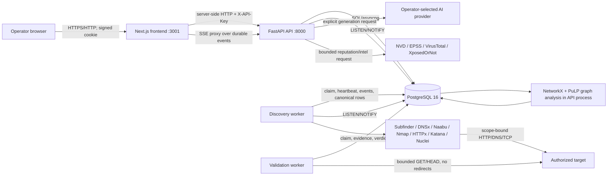
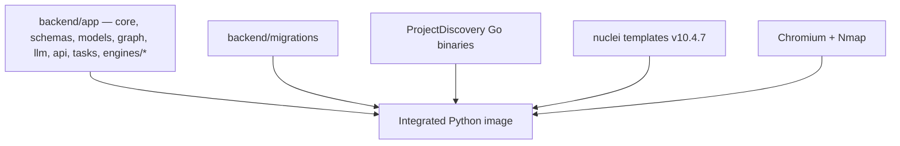
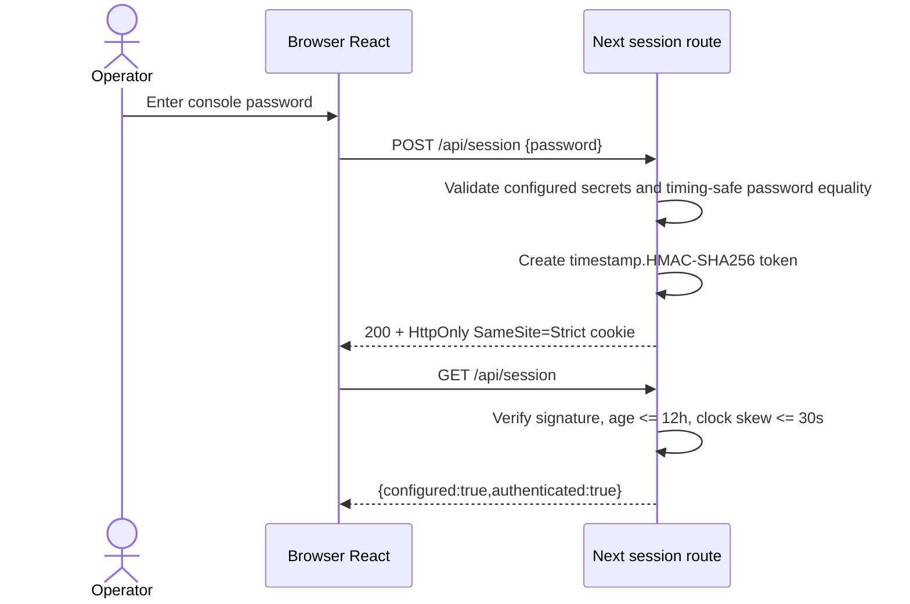
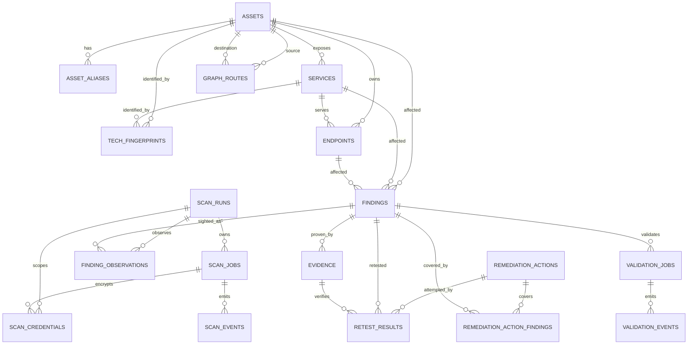
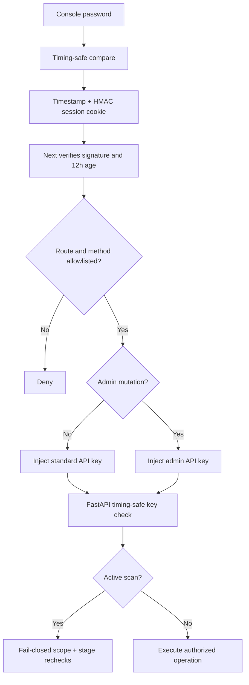

# SENTINAL X: Rebuild-Grade Architecture Specification

Document baseline: repository commit `ae32daa` (`newbranch1`), inspected 2026-09-25. This document describes the checked-in system, including differences between the deployed implementation and the older scaffold. Generated directories (`.git`, `.next`, `.mypy_cache`, `.pytest_cache`, `__pycache__`, virtual environments, database exports, and `node_modules`) are build products rather than source and are intentionally excluded from the source tree inventory.

## 1. Project Overview

### Identity and purpose

The product is **SENTINAL X**, an autonomous cyber-defense platform. It gives security engineers, developers, and SOC analysts one evidence-preserving workflow that discovers an authorized target, confirms findings non-destructively, correlates them into an attack graph, prioritizes break-the-chain remediations, generates grounded repair guidance, retests repairs, and presents the results in an operator console.

The central problem is not merely finding scanner signatures. Independent scanner alerts lack identity, provenance, exploitability proof, business context, and remediation order. SENTINAL X stores every stage in one PostgreSQL-backed domain model and distinguishes tool evidence from AI interpretation. Its lifecycle is:

```text
DISCOVER -> VALIDATE -> CORRELATE -> PRIORITIZE -> REMEDIATE -> RETEST -> REPORT
```

### Target users

| User | Use |
|---|---|
| Application developer | Run an authorized assessment, inspect reproducible evidence, obtain issue-specific code/configuration guidance, and verify a repair. |
| Security engineer | Configure scope and authentication, inspect scan coverage, curate crown jewels and routes, and review attack-path calculations. |
| SOC/operator | Monitor jobs, engage the global kill switch, inspect indicators, and preserve an audit-friendly evidence trail. |
| Judge/auditor | Verify provenance, database durability, deterministic graph analysis, confidence calculations, and before/after retest evidence. |

### Complete feature list

- Password-protected web console with a signed, 12-hour, `HttpOnly`, `SameSite=Strict` session cookie.
- Server-side API-key proxy that prevents discovery and administrative keys from reaching the browser.
- Fail-closed host, wildcard-domain, host-and-port, and CIDR scan authorization.
- Global database-backed kill switch and per-job cancellation checked during every external stage.
- Fast and deep discovery profiles.
- Autonomous authenticated scanning through a generic, verified, scope-checked login (HTML form or JSON/token), with no target-specific presets.
- Multiple named authentication contexts for public-versus-authenticated differential coverage.
- AES-256-GCM encryption and expiry of scan request headers.
- Passive subdomain discovery with Subfinder.
- DNS validation with DNSx.
- Port discovery with Naabu and Nmap service/version enrichment.
- HTTP probing, technology detection, TLS metadata, WAF signal extraction, and soft-404 calibration with ProjectDiscovery HTTPx.
- Standard and Chromium-headless Katana crawling with JavaScript parsing and XHR extraction.
- Bounded fallback breadth-first crawling when Katana fails or omits reachable pages.
- OpenAPI/Swagger probing and operation extraction.
- JavaScript route extraction and bounded sensitive-content path probing.
- HTML form input extraction, canonical query preservation, endpoint classification, and parameter-shape deduplication.
- Nuclei signature scans and parameter-aware DAST scans with intrusive, denial-of-service, brute-force, and OAST templates excluded.
- Partial-output preservation when a Nuclei pass reaches its deadline.
- Scanner-vocabulary mapping into a versioned shared vulnerability contract; unknown classes are quarantined rather than discarded or guessed.
- Stable asset identity and durable per-run finding observations.
- CVE, CPE, CVSS, EPSS, and patch-group enrichment.
- Asynchronous PostgreSQL job claiming, heartbeat recovery, durable ordered events, LISTEN/NOTIFY acceleration, and polling fallback.
- Non-destructive validation oracles for reflection/XSS, error and boolean differential SQL injection, timing, authorization, execution markers, and OOB evidence when explicitly supplied.
- Evidence manifests with redaction, request/response hashes, deterministic seeds, confidence, and tool/AI/human provenance.
- Validation calibration, sanity canaries, false-positive adjudication, and bounded retries/rate limits.
- AND-aware privilege-state attack graph built with NetworkX.
- Evidence/CVSS/class-table provenance on inferred graph semantics.
- Entry-point and crown-jewel asset curation.
- Route and durable fact curation.
- Reachability fixpoint, nearest-miss diagnostics, dominator/chokepoint analysis, cycle handling, and graph pruning.
- Monte Carlo compromise probability with deterministic seed and confidence intervals.
- Minimum patch cut, grouped repair cost, budget-constrained planning, shortest paths, and marginal-risk priority ranking.
- Invariant checks for non-vacuity, cut soundness, irreducibility, monotonicity, pruning, and Monte Carlo consistency.
- Immutable cached graph snapshots and Cytoscape export.
- Scan-specific graph filtering so one assessment does not inherit unrelated findings.
- Deterministic attack-graph report that does not require an AI provider.
- OpenAI-compatible, Google Vertex Express, and Google Generative Language remediation-provider support.
- Ephemeral browser-memory AI credentials; provider keys are sent only for explicit generation and are not persisted by SENTINAL X.
- AI remediation grounded in finding/evidence context with JSON validation, knowledge-base fallback, prompt fingerprinting, and provider metadata.
- Human-authored remediation actions with explicit provenance.
- Patch-group actions that cover every linked finding rather than a hardcoded count.
- Confidence calculated from stored evidence quality and scope, not accepted from model output.
- Mark-applied lifecycle and exact-oracle automated retesting with a fresh immutable evidence record for every attempt.
- URL, fetched-webpage, raw-email, domain, IP, reputation, and email-exposure intelligence.
- SSRF protections for intelligence HTTP requests and private/special-address detection.
- Paginated scan/finding views, evidence viewer, attack-graph visualization, remediation lifecycle, reports, and system inventory/reset controls.
- Optional, separately-run practice targets (not part of the product; see `labs/`).
- Database inspection and optional per-table CSV export script.

## 2. Technology Stack — with theory

### Runtime and infrastructure inventory

| Technology | Exact version/source | Role and design reason | Rejected alternative |
|---|---|---|---|
| Python | `>=3.12,<3.14`; runtime image `python:3.12-slim-bookworm` at the pinned digest in `backend/Dockerfile` | Shared language for API, workers, statistical validation, graph algorithms, and intelligence. The upper bound guarantees wheels for pinned native dependencies. | Polyglot microservices were rejected because they would duplicate contracts and operational state during a hackathon. |
| FastAPI | `0.115.6` | Typed async HTTP/WebSocket surface with generated OpenAPI and dependency-based authentication. | Flask lacks first-class typed request validation; Django adds an unused ORM/admin stack. |
| Pydantic | `2.10.4`; pydantic-settings `2.7.0` | Strict boundary validation and environment parsing. | Hand-written JSON validation is less auditable and easier to bypass. |
| SQLAlchemy | `2.0.36` | Async ORM plus parameterized SQL for PostgreSQL-specific projections. | A raw-SQL-only design would make entity lifecycle and migrations harder to maintain. |
| PostgreSQL | `16-alpine`, image digest pinned in Compose | Single durable source for jobs, ledger events, canonical assets/findings, graph inputs/snapshots, remediation, and retests. PostgreSQL advisory locking, `SKIP LOCKED`, JSONB, LISTEN/NOTIFY, UUID, and transactional constraints fit the queue and evidence model. | Redis/Celery and Neo4j are intentionally not used: they would introduce split-brain job state and a second graph database. |
| asyncpg | `0.30.0` | Async database driver used by the live API and workers. | Synchronous psycopg would block event-loop workers. |
| psycopg2-binary | `2.9.10` | Synchronous migration driver used by Alembic. | Running async migrations adds complexity without runtime value. |
| Alembic | `1.14.0` | Ordered, repeatable database evolution through migrations `0001`–`0008`. | Startup-time `create_all` cannot safely evolve existing data. |
| NetworkX | `3.6.1` | In-process directed graph algorithms, matching ADR-0002 and allowing transparent deterministic inspection. | Neo4j was rejected for prototype operational cost and duplicate persistence. |
| PuLP | `3.3.2` | Binary optimization for grouped minimum-cut selection. | Ad-hoc greedy selection cannot guarantee the constrained optimum. |
| httpx | `0.28.1` | Async/sync bounded HTTP transport, explicit redirect policy, and connection pooling. | `requests` is synchronous and urllib offers weaker ergonomics for authenticated validation. |
| cryptography | `50.0.1` | AES-GCM authenticated encryption for short-lived scan headers. | Plaintext database secrets and reversible unauthenticated encryption were rejected. |
| Next.js | `16.3.5` | App Router UI and same-origin server proxy/session boundary. | A browser-only SPA would expose backend API keys and require permissive CORS. |
| React / React DOM | `19.1.1` | Component/state model for the operator console. | Server-rendered templates cannot provide the live graph and interactive lifecycle efficiently. |
| TypeScript | `5.9.3` | Compile-time UI/API shape checking. | Untyped JavaScript would make cross-layer drift harder to detect. |
| TanStack React Query | `5.90.5` | Request caching, refetching, mutation invalidation, and loading/error states. | Hand-built global fetch state would duplicate cache and retry logic. |
| Cytoscape.js | `3.33.1` | Interactive graph layout and node/edge rendering. | Static SVG cannot support inspection and live recomputation. |
| Recharts | `3.10.1` | Dashboard charts. | Custom Canvas/SVG chart primitives add maintenance cost. |
| react-markdown / remark-gfm | `10.1.0` / `4.0.1` | Safe structured rendering of report and remediation Markdown. Raw HTML is not enabled. | `dangerouslySetInnerHTML` would create an XSS sink. |
| lucide-react | `0.468.0` | Consistent local SVG icon set. | Image icon packs complicate styling and accessibility. |
| Go toolchain | `golang:1.26-bookworm` builder | Reproducibly compiles ProjectDiscovery CLIs. Go is isolated to tool binaries. | Downloading mutable prebuilt binaries would weaken provenance. |
| Subfinder | `2.16.0` | Passive subdomain enumeration. | Active brute-force DNS was excluded from the safe default workflow. |
| DNSx | `1.3.1` | Resolves and validates discovered names. | Direct socket code would recreate a mature resolver. |
| Naabu | `2.6.1` | Fast port discovery, with connect-scan fallback when raw capabilities are absent. | Nmap alone is slower for broad initial discovery. |
| Nmap | Debian Bookworm package | Service/version enrichment and XML output after port discovery. | Banner-only identification provides weaker version evidence. |
| ProjectDiscovery HTTPx | `1.10.0` | HTTP reachability, metadata, technology, TLS, and WAF signals. It lives in `/opt/projectdiscovery/bin` so Python's `httpx` script cannot shadow it. | Custom probing would lose standardized JSONL evidence. |
| Katana | `1.6.1` | Scope-bound standard and Chromium-headless crawling with JavaScript/XHR discovery. | A static crawler cannot see Angular/React runtime routes; a mandatory ZAP service was rejected by ADR-0005. |
| Chromium | current Debian Bookworm security build at image-build time | Executes SPA JavaScript for deep Katana scans. Exact patch pinning is deliberately avoided because Debian removes superseded security packages. | Katana runtime browser download conflicts with network restrictions and reproducible builds. |
| Nuclei | `3.11.0` | Primary JSONL vulnerability scanner selected by ADR-0005. | ZAP is an optional stretch; making it mandatory would add daemon/session complexity. |
| nuclei-templates | Git tag `v10.4.7` | Pinned signatures and `/dast` mutation corpus. | Auto-updating templates makes the same scan non-reproducible. |
| Docker Compose | Compose specification with project name `sentinalx` | One-command topology and a stable bridge for the workers and their targets. | Host-gateway traversal is unreliable on WSL2 and is not the recommended path. |

### Python dependency lock

`backend/uv.lock` is the authoritative complete resolution. The direct production pins are `fastapi==0.115.6`, `uvicorn[standard]==0.34.0`, `sqlalchemy==2.0.36`, `alembic==1.14.0`, `psycopg2-binary==2.9.10`, `pydantic==2.10.4`, `pydantic-settings==2.7.0`, `redis==5.2.1`, `httpx==0.28.1`, `asyncpg==0.30.0`, `tenacity==9.0.0`, `networkx==3.6.1`, `pulp==3.3.2`, and `cryptography==50.0.1`. Development pins are `pytest==8.3.4`, `pytest-asyncio==0.25.2`, `ruff==0.9.1`, `mypy==1.14.1`, and `matplotlib==3.11.2`.

The resolved transitive runtime set is: `annotated-types 0.8.0`, `anyio 4.15.1`, `certifi 2026.7.22`, `cffi 2.1.1`, `click 8.5.0`, `cryptography 50.0.1`, `greenlet 3.5.5`, `h11 0.16.0`, `httpcore 1.0.9`, `httptools 0.8.0`, `idna 3.19`, `Mako 1.4.1`, `MarkupSafe 3.0.3`, `psycopg2-binary 2.9.10`, `pycparser 3.0`, `pydantic-core 2.27.2`, `python-dotenv 1.2.3`, `PyYAML 6.0.3`, `redis 5.2.1`, `sniffio` as resolved in the lock, `starlette 0.41.3`, `typing-extensions 4.16.0`, `uvloop 0.22.1`, `watchfiles 1.2.0`, and `websockets 17.1`. Matplotlib development resolution adds `contourpy 1.4.0`, `cycler 0.12.1`, `fonttools 4.65.0`, `kiwisolver 1.5.1`, `numpy 2.5.3`, `packaging 26.3`, `pillow 12.3.0`, `pyparsing 3.3.2`, `python-dateutil 2.9.0.post0`, and `six 1.17.0`. Rebuilders must install from `uv.lock` with `uv sync --frozen`; this paragraph explains the lock but does not replace it.

### Frontend dependency lock

`frontend/package-lock.json` is lockfile version 3 and is the authoritative full npm graph. Direct production and development versions are listed in the runtime table and `frontend/package.json`. Rebuilders must use `npm ci`, not an unconstrained install. Next's build uses Webpack explicitly (`next build --webpack`) because that is the tested output path.

### External services and APIs

| Service/API | Use | Failure behavior |
|---|---|---|
| NVD API | Optional CVE metadata/CVSS enrichment; key increases quota from the unauthenticated tier. | Best effort; absence does not invalidate discovery. |
| FIRST EPSS | Snapshot probability enrichment for CVEs. | Stage records a coverage gap and preserves findings. |
| OpenAI-compatible Chat Completions | Optional AI remediation/report generation. | Provider errors become HTTP 502; deterministic knowledge-base/report fallback preserves coverage where implemented. |
| Google Generative Language | Native Gemini `generateContent` adapter. | Safe error text is returned without leaking request secrets. |
| Google Vertex Express | API-key `publishers/google/models/{model}:generateContent` adapter. | Same provider boundary and JSON normalization as Gemini. |
| VirusTotal | Optional URL/domain/IP reputation in Slice 8. | Result records unavailable/error state; analyzer does not raise to API caller. |
| XposedOrNot | Free breach-metadata lookup for masked email-exposure results; no API key. | Offline mode skips the request and reports `unavailable`; only breach/category metadata is returned. |

## 3. System Architecture

### Deployed component topology



The root `docker-compose.yml` only names the project and includes `backend/docker-compose.yml`. The active services are `db`, `api`, `worker`, `validation-worker`, and `frontend`. Intentionally-vulnerable practice targets are not part of the product; they run separately from `labs/docker-compose.yml` (see `labs/README.md`). There is no deployed Redis, Celery worker, Neo4j instance, or phishing microservice. Those names belong to the earlier `backend/` architectural scaffold and source plan.

### Image assembly



### Design patterns

| Pattern | Exact location and behavior |
|---|---|
| Modular monolith | `backend/app/main.py` composes graph, intelligence, console, remediation, discovery, and validation routers over one database. |
| Ports/adapters | Slice 5 `Fetcher` protocol separates oracles from `backend/app/engines/validation/transport.py::LiveFetcher`; Slice 7 provider adapters normalize OpenAI and Google responses. |
| Durable queue | `scan_jobs`/`validation_jobs` plus `FOR UPDATE SKIP LOCKED`, heartbeats, attempt counters, and stale-claim recovery replace an external broker. |
| Event ledger | `scan_events` and `validation_events` are append-only per-job sequences; LISTEN/NOTIFY is an acceleration signal, never the source of truth. |
| Repository/data mapper | SQLAlchemy models map canonical rows; service modules issue bounded projections and transactions. |
| Contract adapter | `backend/app/engines/discovery/contract_adapter.py` converts rich discovery rows to the exact graph contract and quarantines unmapped classes. |
| Strategy | Validation chooses an oracle by vulnerability class; remediation chooses a provider adapter; intelligence exposes analyzer-specific strategies. |
| State machine | Scan jobs, validation jobs, findings, remediation actions, and retests use constrained status transitions. |
| Circuit breaker/command guard | `StageGuard` checks global kill switch and cancellation before/during tools and kills the complete subprocess group. |
| Identity map/deduplication | Stable SHA-256 asset IDs, normalized endpoint identity, finding dedup keys, and unique observation keys preserve one canonical issue with many sightings. |
| Content-addressed cache | Graph `input_hash` covers normalized inputs, parameters, and engine fingerprint; identical analysis returns an immutable snapshot. |
| Functional core/imperative shell | Slice 6 graph scoring, reachability, cuts, and exports are pure/deterministic; graph service handles database I/O. |
| Defense in depth | Browser session, proxy route allowlist, backend API key, admin key, Pydantic validation, scan allowlist, scope flags, transport policy, and database constraints are independent controls. |
| Provenance tagging | Evidence and remediation actions persist `generated_by`; graph edges carry `Provenance`. |
| Graceful degradation | Optional stages return diagnostics and coverage status while durable earlier results survive timeouts or unavailable enrichers. |

### Communication matrix

| From | To | Protocol/data |
|---|---|---|
| Browser | Next.js | HTTP JSON, HTML/CSS/JS, same-origin EventSource/SSE; signed cookie authenticates console calls. |
| Next.js proxy | FastAPI | HTTP/1.1 JSON with server-injected `X-API-Key`; request method/body/query preserved only for allowlisted routes. |
| Browser | AI configuration component | Provider base URL/model/key held in React state and optionally `sessionStorage`; the key is included only in explicit generation/test request bodies. |
| API/workers | PostgreSQL | SQL over asyncpg; Alembic uses psycopg2; LISTEN/NOTIFY carries wake-up hints. |
| Worker | scanner tools | Argument arrays over async subprocess pipes; stdin/JSONL/XML; no shell interpolation. |
| Worker/validator | target | DNS, TCP, TLS, HTTP(S); all scan requests must match the configured allowlist and stage scope. |
| API | AI provider | HTTPS JSON, OpenAI chat-completions or Google `generateContent` dialect, synchronous call in a worker thread. |
| API | intelligence providers | HTTPS with analyzer timeouts, result normalization, and SSRF/public-address controls. |
| API | graph engine | In-process typed `GraphInput`; output is a `GraphResult`, snapshot JSON, and Cytoscape elements. |

## 4. Folder & File Structure

The following is the complete checked-in source tree. A trailing explanation is the responsibility of that exact path.

### Root, policy, plans, and launchers

| Path | Purpose |
|---|---|
| `.agent/settings.json` | Agent integration settings for the repository. |
| `.agent/skills/slice/SKILL.md` | Local copy of vertical-slice implementation discipline. |
| `.agents/settings.json` | Multi-agent tooling settings. |
| `.agents/skills/slice/SKILL.md` | Canonical repository-local slice skill. |
| `.claude/settings.json` | Claude coding-agent settings. |
| `.claude/skills/slice/SKILL.md` | Claude-visible copy of slice discipline. |
| `.env.example` | Legacy/planned topology environment example; not the active Compose default. |
| `.gitignore` | Excludes secrets, environments, caches, outputs, and generated artifacts. |
| `.python-version` | Root Python interpreter selection. |
| `AGENTS.md` | Durable engineering rules, canonical intent, guardrails, and commands. |
| `CLAUDE.md` | Claude-facing copy/addendum of project instructions. |
| `GEMINI.md` | Gemini-facing project instructions. |
| `README.md` | Root project introduction and setup entry point. |
| `Commnads_to_run.md` | Operator command crib sheet; filename spelling is part of the repository. |
| `UI_INTEGRATION_MAP.md` | UI-to-backend integration map. |
| `docker-compose.yml` | Canonical launcher; fixes project name and includes Slice 4 Compose. |
| `pyproject.toml` | Root Python project/tool metadata. |
| `setup.sh` | Local bootstrap helper. |
| `SentinalX/logo.png` | Product logo bitmap. |

### Active integrated backend: `backend/app`

| Path | Purpose |
|---|---|
| `backend/.env.example` | Active runtime variables and documented safe defaults. |
| `backend/Dockerfile` | Multi-stage, pinned tool build and integrated application image assembly. |
| `backend/README.md` | Discovery/runtime design and usage specification. |
| `backend/alembic.ini` | Active migration configuration. |
| `backend/app/__init__.py` | Python package marker. |
| `backend/app/core/authenticator.py` | Generic scope-checked, verified target login (HTML form or JSON/token). |
| `backend/app/core/config.py` | Pydantic environment settings singleton. |
| `backend/app/api/console_api.py` | Operator projections, inventory, scan deletion, and full data reset. |
| `backend/app/engines/discovery/contract_adapter.py` | Discovery-to-graph vocabulary projection and contract assertions. |
| `backend/app/core/credentials.py` | AES-GCM credential storage, retrieval, expiry, and redaction helpers. |
| `backend/app/core/db.py` | Async engine/session factory and request dependency. |
| `backend/app/engines/discovery/dedup.py` | URL normalization and finding security-identity hash. |
| `backend/app/engines/discovery/enrichment.py` | CVE/EPSS enrichment and external result handling. |
| `backend/app/api/graph_api.py` | Authenticated graph curation, analysis, recomputation, and snapshot routes. |
| `backend/app/api/graph_service.py` | DB-to-GraphInput loader, cache hash, analysis persistence, and recompute service. |
| `backend/app/api/graph_view.py` | Self-contained fallback graph HTML template. |
| `backend/app/engines/discovery/identity.py` | Stable asset identity and conservative alias merge rules. |
| `backend/app/api/intel_api.py` | Async API wrappers for Slice 8 analyzers. |
| `backend/app/core/killswitch.py` | Database stop checks and subprocess-group termination. |
| `backend/app/main.py` | FastAPI composition, auth dependencies, discovery/validation routes, and WebSocket. |
| `backend/app/models/__init__.py` | Active SQLAlchemy schema for all integrated runtime tables. |
| `backend/app/tasks/queue.py` | Discovery claim/heartbeat/events and PostgreSQL notification bus. |
| `backend/app/api/remediation_api.py` | Remediation/report/action/retest API and graph-grounding logic. |
| `backend/app/schemas/__init__.py` | Discovery/auth/graph Pydantic request and response contracts. |
| `backend/app/core/scope.py` | Allowlist parsing, canonical targets, scope predicates, and network expansion limits. |
| `backend/app/core/subprocess_utils.py` | Bounded subprocess execution with output capture and guard polling. |
| `backend/app/engines/validation/__init__.py` | Integrated validation package marker. |
| `backend/app/engines/validation/service.py` | Candidate-to-oracle validation orchestration and adjudication. |
| `backend/app/engines/validation/transport.py` | Safe live HTTP Fetcher preserving existing query parameters. |
| `backend/app/tasks/validation_queue.py` | Validation claiming, events, heartbeat, and completion functions. |
| `backend/app/tasks/validation_worker.py` | Validation worker loop, candidate hydration, execution, and persistence. |
| `backend/app/engines/discovery/vuln_mapping.json` | Versioned scanner-label/template-to-contract-class registry. |
| `backend/app/tasks/worker.py` | Discovery worker loop and heartbeat wrapper. |
| `backend/app/engines/discovery/__init__.py` | Discovery stage package marker. |
| `backend/app/engines/discovery/parameter_candidates.py` | Parameter candidates, DAST seeds, and signature target selection. |
| `backend/app/engines/discovery/runner.py` | S0–S7 pipeline coordinator, coverage ledger, mapping, and validation enqueue. |
| `backend/app/engines/discovery/s1_recon.py` | Passive Subfinder/DNSx reconnaissance. |
| `backend/app/engines/discovery/s2_ports.py` | Naabu/Nmap service discovery and XML parsing. |
| `backend/app/engines/discovery/s3_fingerprint.py` | HTTPx fingerprinting and soft-404 calibration. |
| `backend/app/engines/discovery/s4_crawl.py` | Katana/headless/fallback/spec/content crawling and endpoint normalization. |
| `backend/app/engines/discovery/s5_vuln_scan.py` | Nuclei signature and DAST passes with safe exclusions. |
| `backend/app/engines/discovery/s7_persist.py` | Canonical asset/service/endpoint/finding/observation persistence. |
| `backend/docker-compose.yml` | Deployed services, volumes, health checks, bridge networking, and lab profile. |
| `backend/inspect_database.sh` | Database inventory viewer and optional CSV exporter. |
| `backend/pytest.ini` | Slice 4 pytest configuration. |
| `backend/scan_target.sh` | End-to-end target scan/event/results helper. |
| `labs/` | Optional, separately-run practice targets; no product code references them. |

### Active migrations and Slice 4 tests

| Path | Purpose |
|---|---|
| `backend/migrations/env.py` | Alembic metadata and sync URL setup. |
| `backend/migrations/versions/0001_initial.py` | Jobs, events, control, initial assets/services/endpoints/findings. |
| `backend/migrations/versions/0002_contract_persistence.py` | Shared-contract projection and observation persistence. |
| `backend/migrations/versions/0003_validation_pipeline.py` | Evidence and validation job/event schema. |
| `backend/migrations/versions/0004_attack_graph.py` | Asset graph fields, routes, facts, and snapshots. |
| `backend/migrations/versions/0005_graph_patch_groups.py` | Patch-group graph support. |
| `backend/migrations/versions/0006_scan_credentials.py` | Encrypted expiring scan credentials. |
| `backend/migrations/versions/0007_remediation_retest.py` | Remediation actions, links, and retest attempts. |
| `backend/migrations/versions/0008_ground_remediation_confidence.py` | Grounded remediation confidence/metadata fields. |
| `backend/tests/__init__.py` | Test package marker. |
| `backend/tests/conftest.py` | Shared paths, fixtures, and import setup. |
| `backend/tests/test_api_security.py` | API key, scope, secret handling, request validation, and auth tests. |
| `backend/tests/test_attack_graph_integration.py` | Live schema-to-graph integration and snapshot semantics. |
| `backend/tests/test_contract_adapter.py` | Mapping vocabulary and quarantine behavior. |
| `backend/tests/test_credentials.py` | AES-GCM, expiry, AAD, and configuration behavior. |
| `backend/tests/test_dedup.py` | Finding/path normalization identities. |
| `backend/tests/test_pipeline_identity.py` | Asset/endpoint identity and stage handoff tests. |
| `backend/tests/test_postgres_persistence.py` | PostgreSQL constraints and durable observation integration. |
| `backend/tests/test_remediation_helpers.py` | Confidence, provider, grounding, and report helper behavior. |
| `backend/tests/test_scope.py` | Allowlist and canonicalization guardrails. |
| `backend/tests/test_subprocess_utils.py` | Timeout, partial output, cancellation, and process-group behavior. |
| `backend/tests/test_validation_service.py` | Integrated oracle selection and evidence persistence. |
| `backend/tests/test_vuln_scan.py` | Nuclei arguments, target sets, exclusions, timeouts, and parsing. |

### Validation engine: `backend/app/engines/validation`

| Path | Purpose |
|---|---|
| `backend/app/engines/validation/README.md` | Validation engine specification and scientific rationale. |
| `backend/app/engines/validation/__init__.py` | Public validation exports. |
| `backend/app/engines/validation/adjudicate.py` | Converts oracle results and sanity state into canonical verdict/confidence. |
| `backend/app/engines/validation/api.py` | Standalone validation API façade. |
| `backend/app/engines/validation/calibration.py` | Threshold calibration and performance measurement. |
| `backend/app/engines/validation/control.py` | Deterministic seeds, limits, stop checks, and execution context. |
| `backend/app/engines/validation/corpus.py` | Synthetic calibration/evaluation corpus. |
| `backend/app/engines/validation/evidence.py` | Recording Fetcher, manifests, evidence store, and deterministic replay. |
| `backend/app/engines/validation/fixtures.py` | Test candidates and expected outcomes. |
| `backend/app/engines/validation/http.py` | Transport-neutral Request, Response, and Fetcher protocol. |
| `backend/app/engines/validation/independence.py` | Scanner-versus-assisted validation scoreboard. |
| `backend/app/engines/validation/limiter.py` | Per-origin request-rate limiter. |
| `backend/app/engines/validation/mock_target.py` | Deterministic vulnerable/non-vulnerable test target. |
| `backend/app/engines/validation/nuclei_scan.jsonl` | Sample Nuclei input fixture. |
| `backend/app/engines/validation/reliability.png` | Generated validation reliability chart. |
| `backend/app/engines/validation/reliability_diagram.py` | Generates the reliability chart. |
| `backend/app/engines/validation/sanity.py` | Negative-control canary preventing misleading verdicts. |
| `backend/app/engines/validation/scanner.py` | Nuclei parser, class mapper, and candidate conversion. |
| `backend/app/engines/validation/scenario.py` | Oracle scenario/data contracts. |
| `backend/app/engines/validation/scope.py` | Standalone validation scope enforcement. |
| `backend/app/engines/validation/scoreboard.png` | Generated benchmark scoreboard. |
| `backend/app/engines/validation/scoreboard_chart.py` | Generates the scoreboard image. |
| `backend/app/engines/validation/writer.py` | Append-only evidence writer and redaction policy. |
| `backend/app/engines/validation/oracles/__init__.py` | Oracle exports. |
| `backend/app/engines/validation/oracles/authz.py` | Two-context authorization/IDOR differential oracle. |
| `backend/app/engines/validation/oracles/combine.py` | Combines independent oracle evidence. |
| `backend/app/engines/validation/oracles/differential.py` | Boolean, reflection, and two-sided error differential oracles. |
| `backend/app/engines/validation/oracles/execution.py` | Harmless execution-marker oracle. |
| `backend/app/engines/validation/oracles/oob.py` | OOB callback evidence adapter; no listener is enabled by default. |
| `backend/app/engines/validation/oracles/timing.py` | Repeated interleaved timing inference with robust statistics. |
| `backend/tests/validation/test_authz.py` | Authorization oracle tests. |
| `backend/tests/validation/test_calibration.py` | Calibration tests. |
| `backend/tests/validation/test_control.py` | Limits and stop-control tests. |
| `backend/tests/validation/test_differential.py` | Differential oracle tests. |
| `backend/tests/validation/test_evidence.py` | Manifest, recording, redaction, and replay tests. |
| `backend/tests/validation/test_phase4_oracles.py` | Timing/execution/OOB/combined oracle tests. |
| `backend/tests/validation/test_scanner.py` | Nuclei mapping/candidate tests. |
| `backend/tests/validation/test_writer.py` | Evidence writer tests. |

### Attack graph: `backend/app/graph`

The attack-graph engine lives in `backend/app/graph`; its regression suite is in `backend/tests/graph/`. The Dockerfile ships it as part of `backend/app`.

| Path | Purpose |
|---|---|
| `backend/app/graph/README.md` | Mathematical graph specification, contracts, and demo instructions. |
| `backend/app/graph/__init__.py` | Public graph exports. |
| `backend/app/graph/_pulp_compat.py` | PuLP binary-variable/solver compatibility helpers. |
| `backend/app/graph/api.py` | Standalone in-memory demonstration router. |
| `backend/app/graph/attack_graph_30.json` | Thirty-node regression fixture. |
| `backend/app/graph/breakchain.py` | Node splitting, min cut, group reduction, MILP labeling, and cycle clusters. |
| `backend/app/graph/build.py` | Graph construction, finding/fact/route edges, phishing/credential attachments, and patched graph. |
| `backend/app/graph/contract.py` | Shared vulnerability/verdict/oracle vocabulary and row validation. |
| `backend/app/graph/cvss.py` | CVSS parser and semantic derivation. |
| `backend/app/graph/demo.py` | CLI demonstration. |
| `backend/app/graph/diagnostics.py` | Analysis-answerability and missing-input diagnostics. |
| `backend/app/graph/dominators.py` | Dominator tree, chokepoints, and betweenness tie-break. |
| `backend/app/graph/export.py` | Cytoscape serialization and labels. |
| `backend/app/graph/fixpoint.py` | AND-aware reachability and nearest miss. |
| `backend/app/graph/invariants.py` | Graph/cut/probability correctness checks. |
| `backend/app/graph/loader.py` | Dictionary, JSON fixture, and database-row adapters. |
| `backend/app/graph/model.py` | Typed graph entities, privilege lattice, provenance, and semantic table. |
| `backend/app/graph/montecarlo.py` | Seeded compromise simulation, intervals, paths, and before/after deltas. |
| `backend/app/graph/pipeline.py` | Complete build/analyze/recompute orchestration. |
| `backend/app/graph/prune.py` | Relevance-preserving graph reduction and statistics. |
| `backend/app/graph/ranking.py` | Path weights, shortest paths, budget plan, and priority ranking. |
| `backend/app/graph/requirements-graph.txt` | Standalone graph dependency pins. |
| `backend/app/graph/scoring.py` | Log-odds probability model and phishing-entry probability. |
| `backend/app/graph/sensitivity.py` | Weight stability and validation ablation. |
| `backend/tests/graph/test_analysis.py` | End-to-end graph analysis/regression tests. |
| `backend/tests/graph/test_contract.py` | Contract vocabulary and normalization tests. |
| `backend/tests/graph/test_core.py` | Core graph construction/reachability/cut tests. |
| `backend/tests/graph/test_scoring_and_api.py` | Probability and standalone API tests. |
| `backend/app/graph/__init__.py` | Deployed graph package exports. |
| `backend/app/graph/_pulp_compat.py` | Deployed PuLP compatibility copy. |
| `backend/app/graph/api.py` | Legacy standalone graph router; integrated routes use Slice 4 graph API. |
| `backend/app/graph/breakchain.py` | Deployed break-chain algorithms. |
| `backend/app/graph/build.py` | Deployed graph builder. |
| `backend/app/graph/contract.py` | Runtime shared contract imported by discovery. |
| `backend/app/graph/cvss.py` | Deployed CVSS semantics. |
| `backend/app/graph/diagnostics.py` | Deployed diagnostic engine. |
| `backend/app/graph/dominators.py` | Deployed chokepoint algorithms. |
| `backend/app/graph/export.py` | Deployed Cytoscape exporter. |
| `backend/app/graph/fixpoint.py` | Deployed reachability engine. |
| `backend/app/graph/fixtures/attack_graph_30.json` | Deployed graph fixture. |
| `backend/app/graph/invariants.py` | Deployed invariant checks. |
| `backend/app/graph/loader.py` | Deployed input loaders. |
| `backend/app/graph/model.py` | Deployed typed graph model. |
| `backend/app/graph/montecarlo.py` | Deployed simulation. |
| `backend/app/graph/pipeline.py` | Deployed analysis coordinator. |
| `backend/app/graph/prune.py` | Deployed pruning. |
| `backend/app/graph/ranking.py` | Deployed ranking/planning. |
| `backend/app/graph/scoring.py` | Deployed probability scoring. |
| `backend/app/graph/sensitivity.py` | Deployed sensitivity analysis. |

### Remediation/retest and intelligence

| Path | Purpose |
|---|---|
| `backend/app/engines/remediation/README.md` | Remediation/retest architecture and provider configuration. |
| `backend/app/engines/remediation/__init__.py` | Package exports. |
| `backend/app/engines/remediation/knowledge_base.py` | Deterministic vulnerability-specific repair guidance. |
| `backend/app/llm/client.py` | OpenAI-compatible and Google provider adapters, safe errors, and response extraction. |
| `backend/app/engines/remediation/prompt.py` | Grounded system/user prompt and fingerprint. |
| `backend/app/engines/remediation/retest.py` | Origin-serialized, kill-switch-aware exact validation replay. |
| `backend/app/engines/remediation/service.py` | JSON extraction/validation and generated remediation normalization. |
| `backend/app/engines/remediation/tests/__init__.py` | Test package marker. |
| `backend/tests/remediation/test_remediation.py` | Prompt, providers, JSON recovery, guidance, and retest tests. |
| `backend/app/engines/intel/__init__.py` | Intelligence package marker. |
| `backend/tests/intel/conftest.py` | Intelligence test fixtures. |
| `backend/app/engines/intel/domain_analyzer.py` | Domain normalization, DNS/WHOIS/TLS/reputation signals. |
| `backend/app/engines/intel/email_analyzer.py` | RFC-aware header/body/link/attachment/spoof analysis. |
| `backend/app/engines/intel/exposure_analyzer.py` | Privacy-preserving XposedOrNot breach-metadata lookup with offline skip. |
| `backend/app/engines/intel/ip_analyzer.py` | IP classification, reverse DNS, and reputation. |
| `backend/app/engines/intel/reputation.py` | Shared VirusTotal result and request adapter. |
| `backend/app/engines/intel/url_analyzer.py` | URL canonicalization, lexical/DNS/TLS/redirect risk and SSRF protection. |
| `backend/app/engines/intel/webpage_analyzer.py` | Bounded webpage fetch, content/form/script/iframe signals, and SSRF protection. |
| `backend/tests/intel/test_domain_analyzer.py` | Domain analyzer tests. |
| `backend/tests/intel/test_email_analyzer.py` | Email analyzer tests. |
| `backend/tests/intel/test_exposure_analyzer.py` | Exposure mode/provider tests. |
| `backend/tests/intel/test_ip_analyzer.py` | IP analyzer tests. |
| `backend/tests/intel/test_reputation.py` | Reputation adapter tests. |
| `backend/tests/intel/test_url_analyzer.py` | URL, TLS, redirect, and SSRF tests. |
| `backend/tests/intel/test_webpage_analyzer.py` | Webpage analysis and fetch-guard tests. |

### Frontend

| Path | Purpose |
|---|---|
| `frontend/.dockerignore` | Excludes local/generated inputs from image context. |
| `frontend/Dockerfile` | Next.js dependency, build, and standalone runtime stages. |
| `frontend/app/api/backend/[...path]/route.ts` | Authenticated method-preserving backend proxy for GET/POST/PATCH/DELETE. |
| `frontend/app/api/events/scan/[jobId]/route.ts` | Authenticated SSE adapter polling the durable event ledger. |
| `frontend/app/api/session/route.ts` | Session status, login, and logout handlers. |
| `frontend/app/globals.css` | Theme tokens, responsive layout, tables, drawers, graph, forms, Markdown, and status styles. |
| `frontend/app/layout.tsx` | Root metadata/font/body and React Query provider. |
| `frontend/app/page.tsx` | Server entry rendering `OperatorConsole`. |
| `frontend/components/ai-provider-config.tsx` | Removable provider configuration panel and ephemeral credential state. |
| `frontend/components/attack-graph.tsx` | Cytoscape lifecycle, styles, layout, selection, and fallback. |
| `frontend/components/intel-view.tsx` | URL/email/domain/IP/exposure forms and structured results. |
| `frontend/components/operator-console.tsx` | Shell, navigation, all operational views, queries, mutations, drawers, and Markdown reports. |
| `frontend/components/query-provider.tsx` | Client QueryClient singleton/provider. |
| `frontend/lib/api.ts` | Typed same-origin API client and error normalization. |
| `frontend/lib/auth.ts` | HMAC session creation/verification and cookie policy. |
| `frontend/lib/proxy.ts` | Backend route allowlist, internal URL construction, and standard/admin key selection. |
| `frontend/lib/types.ts` | JSON and API response interfaces. |
| `frontend/next-env.d.ts` | Next-generated TypeScript declarations. |
| `frontend/next.config.ts` | Standalone output configuration. |
| `frontend/package.json` | Exact npm scripts and direct pins. |
| `frontend/package-lock.json` | Complete reproducible npm graph. |
| `frontend/public/.gitkeep` | Preserves the public directory. |
| `frontend/tsconfig.json` | Strict TypeScript and path alias configuration. |
| `frontend/tsconfig.tsbuildinfo` | Checked-in incremental compiler metadata; generated and safe to regenerate. |

### Legacy scaffold and ADRs

| Path group | Exact purpose |
|---|---|
| `backend/.dockerignore`, `backend/.python-version`, `backend/Dockerfile`, `backend/alembic.ini`, `backend/alembic/env.py`, `backend/alembic/script.py.mako` | Original backend build/migration scaffold. The active integrated image uses its dependency lock but Slice 4 migrations/application. |
| `backend/alembic/versions/6117df8bfe59_initial_data_model.py` | Original normalized model migration. |
| `backend/alembic/versions/b2f1a9c4d7e0_add_audit_log.py` | Original audit-log migration. |
| `backend/app/__init__.py`, `backend/app/main.py`, `backend/app/config.py`, `backend/app/db.py` | Older FastAPI entry/config/database implementation, not launched by root Compose. |
| `backend/app/api/__init__.py`, `backend/app/api/core_routes.py` | Older health, scope, kill-switch, and audit API. |
| `backend/app/core/__init__.py`, `audit.py`, `errors.py`, `killswitch.py`, `scope.py` | Older Redis-backed core guardrail implementation. |
| `backend/app/engines/__init__.py` and `correlation`, `discovery`, `prioritization`, `remediation`, `retest`, `validation` package markers | Planned engine namespace; active engines live in slices. |
| `backend/app/llm/__init__.py`, `backend/app/report/__init__.py`, `backend/app/tasks/__init__.py`, `backend/app/tools/__init__.py` | Planned package markers. |
| `backend/app/models/__init__.py`, `asset.py`, `attack_path.py`, `audit.py`, `base.py`, `edge.py`, `evidence.py`, `finding.py`, `remediation.py`, `retest.py` | Original ORM model set; not the active integrated schema. |
| `backend/app/schemas/__init__.py`, `asset.py`, `attack_path.py`, `audit.py`, `edge.py`, `enums.py`, `evidence.py`, `finding.py`, `remediation.py`, `retest.py` | Original Pydantic contracts retained as architectural reference/tests. |
| `backend/pyproject.toml`, `backend/uv.lock` | Authoritative integrated Python dependency manifest and full lock. |
| `backend/tests/__init__.py`, `backend/tests/test_health.py` | Scaffold test package and health test. |
| `backend/tests/core/__init__.py`, `test_audit_api.py`, `test_killswitch.py`, `test_scope.py` | Older core guardrail tests. |
| `backend/tests/schemas/__init__.py`, `test_data_model.py` | Original schema contract tests. |
| `backend/tests/correlation/__init__.py`, `discovery/__init__.py`, `prioritization/__init__.py`, `remediation/__init__.py`, `retest/__init__.py`, `validation/__init__.py` | Reserved original test package markers. |
| `docs/adr/0001-record-architecture-decisions.md` | Establishes ADR process. |
| `docs/adr/0002-graph-store-networkx.md` | Chooses NetworkX plus PostgreSQL rows/JSON. |
| `docs/adr/0003-validation-active-nondestructive.md` | Requires safe active confirmation. |
| `docs/adr/0004-topology-monolith-plus-one-service.md` | Records planned monolith plus phishing service; active runtime has not created that service. |
| `docs/adr/0005-primary-scanner-nuclei.md` | Selects Nuclei and makes ZAP optional. |
| `docs/adr/0006-discovery-canonical-db-projection.md` | Defines canonical discovery persistence and graph projection. |

For literal, file-by-file completeness within the legacy groups: `backend/app/core/audit.py` records audit events; `backend/app/core/errors.py` defines scaffold errors; `backend/app/core/killswitch.py` is its Redis switch; `backend/app/core/scope.py` is its scope checker. `backend/app/engines/correlation/__init__.py`, `backend/app/engines/discovery/__init__.py`, `backend/app/engines/prioritization/__init__.py`, `backend/app/engines/remediation/__init__.py`, `backend/app/engines/retest/__init__.py`, and `backend/app/engines/validation/__init__.py` are empty namespace markers. `backend/app/models/base.py` defines the scaffold Base/timestamps; `backend/app/models/asset.py`, `backend/app/models/attack_path.py`, `backend/app/models/audit.py`, `backend/app/models/edge.py`, `backend/app/models/evidence.py`, `backend/app/models/finding.py`, `backend/app/models/remediation.py`, and `backend/app/models/retest.py` define their named scaffold ORM entities. `backend/app/schemas/enums.py` defines shared scaffold enums; `backend/app/schemas/asset.py`, `backend/app/schemas/attack_path.py`, `backend/app/schemas/audit.py`, `backend/app/schemas/edge.py`, `backend/app/schemas/evidence.py`, `backend/app/schemas/finding.py`, `backend/app/schemas/remediation.py`, and `backend/app/schemas/retest.py` define create/read DTOs for their named entities. `backend/tests/core/test_audit_api.py`, `backend/tests/core/test_killswitch.py`, and `backend/tests/core/test_scope.py` test those scaffold controls; `backend/tests/schemas/test_data_model.py` tests schema validation. `backend/tests/discovery/__init__.py`, `backend/tests/prioritization/__init__.py`, `backend/tests/remediation/__init__.py`, `backend/tests/retest/__init__.py`, and `backend/tests/validation/__init__.py` preserve empty test namespaces.

## 5. Component Deep-Dives

### 5.1 Configuration, database, scope, identity, and credentials

`app.core.config.Settings` is instantiated once as `_base_settings` and wrapped by `app.core.runtime_config.RuntimeSettingsProxy`, exported as `settings`. It reads `.env`, ignores unknown keys, and exposes all active variables enumerated in section 10. No active module should read `os.environ` directly. The proxy adds an operator-override layer (ADR-0007 D6): the effective value of any tunable setting is `operator override (DB) -> .env -> code default`, and existing `settings.foo` reads are unchanged. Overrides live in the single-row `runtime_settings` table, are restricted to the keys in `app.core.runtime_config.SETTINGS_REGISTRY`, and are type-coerced and bounds-checked on write. The console reads/writes them through `GET /api/v1/console/settings` and the admin-gated `PATCH`/`POST .../reset`, every change is appended to `config_audit`, and the API process and both workers reload the overrides (at startup and at the start of each job) so a change applies to the next job without a restart. `app.core.db` lazily creates one async SQLAlchemy engine, yields transaction-scoped `AsyncSession` instances through `get_session()`/`get_session_dep()`, and prevents request handlers from sharing sessions.

`app.core.scope` is the authorization boundary. It parses each comma-separated allowlist entry into an exact host, optional port, wildcard suffix, or IP network. `parse_target` accepts a hostname, host/port, HTTP(S) URL, IPv4, or bracketed IPv6 and emits a normalized target. `canonical_root_hostname` derives the stable host root. `is_in_scope` rejects malformed URLs, unlisted hosts, port mismatches, and wildcard apex mismatches. Network enumeration is bounded; it is never inferred from DNS adjacency. Every scan submission and each pipeline gate rechecks scope, and Katana/Nuclei receive their own bounded targets.

`app.engines.discovery.identity.stable_asset_id` returns the hexadecimal SHA-256 of the canonical lower-case hostname. `registrable_domain` derives the conservative organizational domain used for alias decisions. `may_merge_by_alias` never treats shared IP, certificate SAN, or favicon as a transitive identity proof across registrable domains; IP merging requires a dedicated-IP signal.

`app.core.credentials` performs these operations:

1. Decode `DISCOVERY_CREDENTIAL_ENCRYPTION_KEY` as URL-safe base64 and require exactly 32 bytes.
2. Validate header names/values at the Pydantic boundary and serialize the header dictionary as compact JSON.
3. Encrypt with AES-256-GCM using a random 96-bit nonce and associated data binding the ciphertext to `scan_job_id:auth_context`.
4. Store only ciphertext, context, job/run IDs, creation time, and expiry. Job rows contain header names only.
5. On load, delete expired records, authenticate/decrypt surviving records, and return context-to-header mappings.
6. Redaction helpers replace authorization, cookie, API-key, and supplied secret values in diagnostics before persistence.

Missing/invalid encryption configuration raises `CredentialConfigurationError`; authenticated scan creation translates it to HTTP 422. Authentication failure never falls back to a public scan silently.

### 5.2 Automatic target authentication

`authenticator.resolve_auth_headers(target, auth, in_scope)` accepts a previously scope-checked target, one `ScanAuthLogin`, and a scope predicate re-applied to every URL the login flow touches. Authentication is generic — no target-specific presets (see ADR-0007). Two methods are supported. A **form** login GETs the login page, selects the form containing a password field, copies all of that form's inputs (hidden CSRF/anti-forgery tokens included), overrides them with the operator's `fields`, POSTs to the form's action, and derives the session from the resulting cookies. A **json** login POSTs `json_body` to `login_url`, reads a token from a dotted response JSON path or a named response header, and injects it on subsequent requests through an operator header template (default `Authorization: Bearer {token}`).

`_scoped_request` disables httpx auto-redirects (`follow_redirects=False`) and follows each hop manually, re-checking the login endpoint, every `Location`, and the success-check URL against the allow-list before fetching; an out-of-scope hop raises `AuthLoginError` and nothing off-scope is requested. The login is never assumed from a returned cookie/token alone: `_verify_session` GETs a check URL (the target by default) and confirms the session with operator markers (`success_contains`, `success_status`, `failure_contains`) and default guardrails that reject a 401/403 or a redirect back to the login page. Unsuccessful login statuses and empty sessions raise `AuthLoginError`; login failure never degrades to a silent unauthenticated scan. Credentials exist only in request memory; `main.create_scan` stores only the derived session header through the encrypted credential store.

### 5.3 Discovery API, queues, and workers

`main.require_api_key` and `require_admin_api_key` use `hmac.compare_digest`. `lifespan` initializes the optional notification bus. Liveness proves the process runs; readiness executes `SELECT 1`.

`main.create_scan` performs, in order: API authentication; authenticated-scan encryption-key check; allowlist parse and target authorization; optional automatic login; normalization of manual/custom contexts; UUID creation; transactional insertion of `scan_runs` and `scan_jobs`; encrypted context storage; commit; optional PostgreSQL notification; and HTTP 202. `custom_header_names` is explicitly JSON-encoded then cast to JSONB so asyncpg never receives an ambiguous Python list binding. `get_scan`, `get_scan_events`, `cancel_scan`, kill-switch handlers, `get_scan_results`, validation handlers, and the WebSocket implement the route behavior specified in section 8.

`queue.claim_next_job` opens a transaction, recovers stale claims whose heartbeat exceeds `STALE_JOB_THRESHOLD_SECONDS`, permanently fails rows that exhausted `MAX_JOB_ATTEMPTS`, and claims one queued row with `FOR UPDATE SKIP LOCKED`. It increments `attempt_count`, sets owner/timestamps/status, and returns a plain dictionary. `heartbeat`, `mark_completed`, and `mark_failed` update durable state. `HeartbeatLoop` maintains heartbeat while a long stage runs. `emit_event` obtains the next per-job sequence while holding the job row lock, inserts the event, commits it, and notifies listeners. `poll_events_since` returns the ordered replay ledger.

`NotifyBus` owns a dedicated asyncpg LISTEN connection, performs a startup self-test, distributes payloads to in-process subscriber queues, reconnects when possible, and exposes `healthy`. Correctness never depends on notifications: workers poll, and WebSocket clients query the event table after every wake-up or interval.

`worker.main` creates a stable worker ID, initializes notifications, repeatedly claims a discovery job, starts a heartbeat, calls `run_pipeline`, and marks completion or failure. Kill-switch/cancel exceptions result in an explicit terminal state and event. Unexpected exceptions are bounded before persistence. `validation_worker.main` mirrors the pattern for validation jobs. `DatabaseStopCheck` exposes a synchronous callback that checks both global switch and source scan cancellation immediately before each validation request.

### 5.4 Discovery pipeline S0–S7

`runner.run_pipeline(job)` is restartable orchestration around canonical database state and a coverage ledger.

1. **Credential hydrate:** `load_for_job` returns named encrypted contexts; public context `none` is always present.
2. **S0 authorize/seed:** `_gate` rechecks allowlist, global switch, and cancellation. The stable asset is upserted. An explicit URL becomes one constrained service and suppresses broad host reconnaissance.
3. **S1 passive reconnaissance:** bare domains run `run_s1_passive_recon`; URL targets and offline mode skip it. Every discovered hostname is independently allowlist-filtered, and accepted/rejected counts are recorded.
4. **S2 services:** each accepted host runs Naabu then Nmap, or an explicit URL produces its declared HTTP(S) service. `web_url_for_service` creates an origin only from observed application-protocol evidence. Assets/services are upserted before later stages.
5. **S3 fingerprint:** HTTPx probes every web origin; technologies, WAF signal, TLS/service data, and soft-404 signatures are recorded. Non-zero tool status yields `degraded`, not data loss.
6. **S4 crawl:** each origin runs once per public/auth context. Only endpoints that still pass scope are accepted. Endpoints are upserted, and `auth_required` is true only when the same service/path/method shape has no public counterpart.
7. **S5 vulnerability scan:** per context, endpoints are collapsed into bounded signature targets and DAST seeds. Nuclei runs both passes, attaches the context to raw findings, and retains pass diagnostics. Independently, every parameterized endpoint becomes a validation candidate even if Nuclei emits no signature.
8. **S6 enrichment:** unique CVEs are batch-enriched with EPSS unless offline/no CVEs; Nuclei classification remains a fallback snapshot.
9. **S7 mapping/persistence:** raw findings are mapped using template, CWE, and tag priority; endpoints/parameters are matched; each finding is contract-projected and persisted with an observation. Parameter hypotheses become explicit unvalidated candidate findings. Mapped candidates enqueue validation; unmapped candidates remain durable quarantine rows. Scan statistics, complete coverage, unmapped classes, completion time, and events are committed.

Every stage emits `stage:start` and `stage:done`; long crawl/scan work emits progress. `completed`, `constrained`, `degraded`, and `skipped` are meaningful coverage states. A degraded tool may still contribute parsed output.

#### S1–S3 functions

| Function | Inputs → output | Behavior/errors |
|---|---|---|
| `s1_recon.run_s1_passive_recon(domain)` | hostname → sorted host list | Runs Subfinder JSONL and DNSx; returns only parsed names; offline/failure is diagnosed upstream. |
| `s2_ports.run_s2_port_scan(host)` | host → `{services, diagnostics}` | Uses Naabu discovery and Nmap XML enrichment; connect fallback is available without raw capabilities. |
| `s2_ports._parse_nmap_xml(text)` | XML → service dictionaries | Extracts port, transport, state, name/product/version/tunnel/CPE defensively. |
| `s2_ports._format_banner(element)` | Nmap service element → text/null | Joins meaningful product/version/extra information without fabricating a version. |
| `s3_fingerprint.run_s3_fingerprint(origins)` | URL list → probes/soft-404/diagnostics | Runs ProjectDiscovery HTTPx JSONL with technology/TLS/WAF fields and normalizes output. |
| `s3_fingerprint.establish_soft_404_signature(base)` | origin → status/length/hash/null | Fetches a random impossible path to identify custom 200/404 pages. |
| `s3_fingerprint.matches_soft_404(signature,status,length,hash)` | observation → boolean | Suppresses pages matching calibrated not-found shape. |

#### S4 crawler internals

`run_s4_crawl(target, soft_404_signature, headers, auth_context, profile)` builds a Katana argument array containing JSONL, JavaScript crawling/parsing, configured depth/page/JS limits, crawl-scope regex, and `_CRAWL_EXCLUDE_PATTERN`. Deep scans add `-headless`, long-form `-no-sandbox`, XHR extraction, and system Chromium. It never adds Katana `-ns` (no-scope). Katana output is parsed even when the process times out. The function then combines Katana, fallback crawl, spec probing, and content probing before canonical deduplication.

| Function/class | Responsibility |
|---|---|
| `_SurfaceParser` | Extracts anchors, forms, input/select/textarea names, scripts, methods, and action URLs from HTML. |
| `_seed` | Creates a guaranteed target endpoint so the pipeline retains coverage when crawlers fail. |
| `_parse_katana` | Reads JSONL request `endpoint`, response metadata, method/source, body/query parameter names, and request template; filters soft-404 and out-of-root URLs. |
| `_fallback_crawl` | Bounded same-root BFS using supplied headers; skips logout/setup/security state-changing paths; extracts forms and JS. |
| `_extract_js_routes` | Resolves string route/API patterns in downloaded JavaScript under the authorized root. |
| `_probe_spec_paths` | Checks bounded OpenAPI/Swagger locations and parses JSON/YAML documents. |
| `_openapi_operations` | Resolves OpenAPI path/operation parameters and methods into endpoint records. |
| `_probe_content_paths` | Checks a fixed defensive-interest path corpus such as metrics/log/support paths and follows directory children under limits. |
| `_directory_children` | Extracts safe immediate directory-listing children. |
| `_bounded_fetch` | Applies timeout and body cap to fallback/spec/content fetches. |
| `_request_template` | Retains safe request body/header structure needed for validation. |
| `_extract_param_names` | Reads query names from `request["endpoint"]` first, then `url`, and unions dictionary `body_params`; this Katana key order is load-bearing. |
| `_katana_endpoint_class` | Labels XHR, REST, GraphQL, SOAP, or unknown using source/content/path evidence. |
| `_dedupe_endpoints` | Merges exact method/path/context identities while unioning parameter evidence. |
| `_safe_stderr` | Bounded UTF-8 decode plus supplied-secret redaction. |
| `_origin_parts`, `_same_authorized_root`, `_crawl_scope_regex` | Canonical scheme/host/effective-port/root-path scope enforcement. |
| `normalize_discovered_endpoint` | Rejects credentials, unsupported schemes, invalid ports, cross-root redirects, fragments, and malformed URLs; returns canonical URL/path. |

The exclusion pattern and fallback skips are deliberate: an authenticated crawl must not click logout or setup/install/reset controls. They are generic, name-based heuristics with no application-specific paths. Removing them invalidates downstream observations.

#### S5 targeting and scan

`parameter_candidates.candidates_for_endpoints` expands each endpoint parameter into a stable `(endpoint, parameter, class, auth_context)` candidate, prioritizes higher-value XHR/REST/GraphQL and authenticated shapes, and caps unique attack surface. `_param_shape` strips values while retaining the parameter-name shape. `dast_seed_urls` keeps full canonical query strings and selects endpoints with parameters or class `xhr`, `rest`, or `graphql`; `signature_scan_targets` collapses equivalent paths for non-mutating templates.

`s5_vuln_scan.build_tag_allowlist` maps observed stacks to relevant tags while retaining baseline web tags. Modern Node.js, Express, Angular, and React fingerprints are recognized. `run_s5_vuln_scan(signature_targets, dast_seeds, tags, waf_detected, profile, headers)` runs two explicit Nuclei passes. Signature mode uses the pinned root templates; DAST mode uses only `/opt/nuclei-templates/dast`. Both use JSONL, no update, bounded rate/concurrency/timeout, redacted custom headers, and excluded tags for `dos`, `fuzz`, `brute-force`, `intrusive`, and OAST-dependent behaviors. WAF detection lowers concurrency/rate. `_parse_jsonl` ignores malformed/non-object lines without discarding valid siblings. `_safe_stderr` redacts secrets. Return value is `{findings, diagnostics}` with pass, return code, timeout, and finding count.

#### Persistence and contract projection

`s7_persist.upsert_asset`, `upsert_service`, and `upsert_endpoint` use conflict-safe identities and update last-seen/richer observations. `persist_http_observations` converts HTTPx metadata to service/TLS/technology rows. `compute_discovery_confidence` derives a bounded score from evidence type and severity rather than validation. `persist_finding` computes the dedup key, applies contract values, upserts the global finding, and always calls `_record_observation`; `observation_source_ref` stabilizes repeated tool references. A partial timed-out tool pass is retained as `partial=true` observation.

`contract_adapter.promote_candidate` consults `vuln_mapping.json`; direct shared vocabulary is accepted, registered aliases are promoted, and unknown `nuclei:*` names stay unmapped. `assert_vocabulary_matches_graph` fails startup/tests if discovery mapping and graph vocabulary drift. `contract_projection_values` supplies class, patch hours/group, semantics fields, and diagnostics. `discovery_finding_to_contract_row` returns a graph-safe row only when the mapping is valid. `dedup.normalize_path_for_dedup` removes volatile values but retains parameter-name shape; `compute_dedup_key` hashes asset/service/path/method/class/parameter/auth-relevant identity.

### 5.5 Validation engine

The validation engine proves a narrow security claim without exploiting the target. Its principal data structures are `Request(method,url,params,headers,body)`, `Response(status,body,headers,elapsed_ms)`, `Candidate`, `OracleResult`, `Verdict`, and an evidence manifest containing every bounded transaction.

`validation_worker._load_candidate` joins finding/endpoint/evidence context, retrieves the endpoint's full parameter set for sibling preservation, selects Nuclei matchers, and decrypts the matching scan auth context. `_run_in_thread` invokes `validate_finding` without blocking the async queue. `_persist` writes a new tool-generated Evidence row, sets the finding verdict/confidence/evidence/observed semantics, and stores the validation result. A failed validator marks the job failed without manufacturing a false-positive verdict.

`validation.service.validate_finding(candidate, matchers, should_stop, headers)` executes this workflow:

1. Normalize the endpoint and parameter; reject missing/unsupported contract fields.
2. Construct a `LiveFetcher`, bounded `EvidenceStore`, deterministic control seed, and per-origin limiter.
3. Run a negative-path sanity canary unless an intentionally two-sided error fallback disables it.
4. Select the oracle by `vuln_class`: reflection/XSS, boolean/error SQLi differential, timing, authorization, execution, or OOB evidence.
5. Add sibling query parameters through `_with_sibling_params`; this preserves form controls such as a form's `Submit` field.
6. Record every request and response with secrets redacted and bodies hashed/capped.
7. If primary SQLi evidence is inconclusive, call `run_error_differential` with `check_sanity=False` as a sound two-sided fallback.
8. Adjudicate the oracle signal, sanity result, independence, and attempt state into `validated`, `false_positive`, `inconclusive`, or `unverifiable_safely` and a bounded confidence.
9. Emit observed requirements and `observed_grants=["user_session"]` for a successful application finding; `session_access` is not a valid graph privilege.

`LiveFetcher.__call__` checks stop state before every request, permits only GET/HEAD, resolves relative URLs, applies the same allowlist, enforces `VALIDATION_REQUESTS_PER_SECOND`, never follows redirects, limits bytes, and records elapsed time. Crucially, it parses the endpoint's existing query, removes only names being injected, appends injected pairs, and calls httpx with a queryless base URL. Replacing rather than merging that query would drop sibling fields and is prohibited.

Oracle behavior:

| Oracle | Proof method | Safe failure |
|---|---|---|
| Reflection/XSS | Unique random marker and context-sensitive response delta. | Marker absent/escaped is negative or inconclusive; no persistent payload. |
| Boolean differential SQLi | Interleaved true/false controls with body/status similarity and independence. | Unstable baseline becomes inconclusive. |
| Error differential SQLi | Benign baseline, quote/error stimulus, and neutralized control; requires asymmetric database-error evidence. | Generic error pages affecting both sides do not validate. |
| Timing | Repeated randomized control/probe order with robust median/MAD-style separation and minimum effect. | Network variance or request cap produces inconclusive. |
| Authorization | Same resource under two explicitly supplied identities, comparing controlled access. | Missing second identity is `unverifiable_safely`. |
| Execution | Harmless unique marker appears only when the target evaluates input. | No system commands or data extraction are attempted. |
| OOB | Accepts independently observed callback evidence. | No OAST listener is configured by default; absent infrastructure cannot validate. |

`EvidenceStore` makes manifests immutable at completion; `RecordingFetcher` appends transactions; `record_run` wraps an oracle; `replay` reproduces it with the same seed. `writer` redacts authorization/cookie/token/password keys, caps excerpts, writes atomically to `EVIDENCE_STORE_PATH`, and never stores response bodies as unbounded DB blobs. `calibration` fits thresholds only on the fitting corpus and evaluates on a disjoint corpus. `independence.build_scoreboard` reports scanner-only and assisted performance without contaminating ground truth.

### 5.6 Attack graph engine

#### Model and contract

`model.Asset`, `Finding`, `Fact`, `Route`, and `GraphInput` are frozen typed inputs. Nodes are tuples serialized by `nid`: `("state", asset_id, privilege)`, `("vuln", finding_id)`, and `("fact", kind, ref)`. The privilege lattice is `none < network < user_session < user < admin/root`; `implies` adds lower privilege states when a higher state is reached. `Provenance` is `evidence`, `cvss_vector`, `observed`, `class_table`, or `assumed`. `Semantics` contains requirements, grant, locality, and interaction implications. `semantics_for` uses the explicit vulnerability table; `cvss.semantics_from_finding` prefers validated observations, then CVSS, then class-table defaults and records the source.

`contract.py` defines the authoritative `VULN_CLASSES`, `M2_EMITTED_CLASSES`, verdict sets, oracle-to-requirements/grants, and default patch hours. `validate_finding_row` emits structured problems for missing/invalid class, verdict, confidence, asset, endpoint semantics, and patch data. `normalise_finding_row` produces canonical tuples/scalars. `validate_batch` reports every row problem. `patch_group_for` groups repairs by class plus CVE/component/endpoint as available; `patch_hours_for` provides class defaults.

#### Build and analysis

`build_graph` creates privilege-state nodes per asset, local implication edges, route edges, fact nodes, vulnerability nodes, requirement edges, and a vulnerability-to-granted-state edge weighted by `edge_probability`. Only validated live findings become exploitable edges; unvalidated/unmapped data remains inventory. `attach_phishing_entry` and `attach_breached_credential` add explicitly sourced entry facts. `or_relaxation` creates a graph suitable for algorithms that cannot express AND prerequisites. `remove_patched` removes selected vulnerability nodes. `provenance_report` counts every inferred source.

`fixpoint.reachable` iterates until no state changes: entry states/facts seed the set, ordinary edges propagate, and vulnerability nodes activate only when all required predecessors are reached. It returns reached nodes and causal predecessors. `jewels_reached`, `sink_reachable`, and `nearest_miss` explain success or missing prerequisites.

`scoring.edge_probability` combines CVSS exploitability, EPSS, validation confidence, authentication/user-interaction/network requirements, and configurable weights in log-odds space, then clamps probability away from 0/1. `phishing_entry_probability` maps a 0–100 intelligence score to a probability. No probability is hardcoded per finding ID.

`montecarlo.simulate` uses a local seeded random generator for the requested number of trials. Each trial samples enabled vulnerabilities, evaluates AND-aware reachability, accumulates crown-jewel compromise, node/edge frequency, and modal paths, and reports Wilson-style 95% half-widths. Same input/seed/trials reproduces the result. `delta` compares pre/post repair risk; `modal_path_for` returns the dominant causal path.

`breakchain.node_split` transforms patchable vulnerability nodes into capacity edges. `min_cut` calculates a cut, `reduce_cut` removes redundant members, and `label_cut` solves patch-group binary selection using PuLP so one group cost covers all member findings. `cycle_clusters` reports strongly connected vulnerability components; `solve` chooses the sound method. An unanswerable/no-jewel graph returns diagnosis instead of claiming safety.

`dominators.dominator_tree` and `chokepoints` find nodes appearing on all relaxed entry-to-jewel paths; `betweenness_tiebreak` ranks equally dominant nodes. `ranking.k_shortest_paths` returns bounded simple paths; `budget_plan` optimizes selected patch groups under hours; `priority_ranking` combines marginal Monte Carlo risk reduction, chokepoint role, and cost. `prune` retains entry-to-jewel relevant nodes plus AND preconditions; `prune_stats` quantifies reduction.

`invariants.verify` runs: non-vacuous analysis; prune invariance; cut soundness; cut irreducibility; cut/dominator consistency; patch monotonicity; Monte Carlo bounds; and deterministic consistency. `diagnose` labels missing entries, crown jewels, routes, validated findings, reachable paths, or non-patchable paths and gives concrete fixes. `sensitivity.weight_stability` perturbs model weights and reports top-k stability; `validation_ablation` quantifies the effect of excluding validation confidence.

`pipeline.run` validates input, builds/prunes, computes reachability/diagnosis, Monte Carlo risk, cut, chokepoints, paths, budget plan, priority, invariants, sensitivity, provenance, and Cytoscape output into `GraphResult`. `recompute` removes selected finding IDs and returns before/after risk and reachability. `export.to_cytoscape` converts typed tuples to `{nodes:[{data}],edges:[{data}]}` with risk/cut/chokepoint metadata.

#### Database graph service

`graph_service.load_graph_input(session, scan_run_id)` loads assets, mapped validated findings, routes, and facts. With a scan ID it filters findings through `finding_observations`, preventing cross-scan contamination; assets referenced by those findings and explicitly curated graph rows remain available. Rows pass the contract loader. `engine_fingerprint` hashes graph source/version inputs. `analysis_hash` hashes normalized GraphInput, parameters, scan selection, and engine fingerprint. `analyze_and_persist` returns the existing `GraphSnapshot` on a hash hit or runs analysis and inserts an immutable snapshot. `priority_payload` and `snapshot_payload` provide API JSON. `recompute_live` rejects unknown patch IDs and executes a non-persisted what-if comparison.

### 5.7 Remediation and automated retesting

`GenerationRequest` accepts `provider` (`openai_compatible` or `vertex_express`), `base_url`, `api_key`, and `model`. `ProviderConfig.endpoint` allows HTTPS providers and HTTP only for localhost/127.0.0.1/host.docker.internal. Vertex model IDs match a strict character expression. `_headers` adds a Bearer token only for OpenAI-compatible providers. Provider bodies use temperature `0.1`, 8192 output tokens, and JSON response mode. Vertex moves system text to `systemInstruction`, uses `responseMimeType=application/json`, and supplies the API key as query `key`.

`chat` performs at most three calls for HTTP 429, honoring a bounded `Retry-After` or exponential delay. `_safe_error` returns at most 300 characters and never includes credentials. `_content` supports string, multipart, safe JSON-only `reasoning_content`, and legacy text; `_vertex_content` joins candidate text parts. Metadata records provider, request ID, resolved model, usage, and status. `list_models` calls `/models` for compatible providers; Vertex Express has no portable listing, so it performs a tiny selected-model generation check.

`prompt.build_prompt` instructs the model to separate observed evidence from assumptions and return one strict object containing `root_cause`, `recommendation_markdown`, `action_kind`, nullable `code_diff`, confidence, assumptions, and regression tests. `prompt_fingerprint` SHA-256 hashes canonical messages. `service._json_object` removes a JSON fence and uses `JSONDecoder.raw_decode` from the first object, tolerating provider preamble/trailing text but never using `eval`. `generate_remediation` retries once with a JSON-repair instruction, validates required fields/kind, removes ungrounded code diffs when source context is absent, rejects virtual patches that match exploit literals without structural input validation, truncates persisted fields, and returns provider/prompt metadata. Model confidence is retained in metadata, but stored action confidence is recomputed by `_grounded_confidence` from evidence completeness, validation confidence, finding coverage, and source availability.

`remediation_api._context` constructs bounded Markdown solely from database assets/findings/evidence and returns risk snapshot plus evidence markers. `_group` selects all findings sharing a patch group. `_generate` reuses an active group action when appropriate, calls Slice 7, links every covered finding, and commits `generated_by="ai"`. `_request_facts`, `_stack`, and `_markers` ground the prompt. `_deterministic_remediation` uses `knowledge_base.guidance` when AI generation is unavailable. `_graph_report` runs scan-specific deterministic analysis and maps finding roles; `_finding_graph_role` explains cut/chokepoint/path status; `_vuln_section` combines graph role with an existing/generated/fallback action.

Full scan reporting selects every validated finding, groups by patch group, processes at most 80 defensive report items, records group-specific generation errors, and always emits deterministic sections for failed provider calls. Thus a report cannot incorrectly say zero findings merely because AI returned invalid JSON. The standalone graph-report route never calls AI.

Retesting requires an action in `applied` state. `_candidate` reconstructs the same finding, endpoint siblings, matchers, and decrypted auth headers used during validation. `app.engines.remediation.retest.replay` serializes requests per origin, opens a dedicated kill-switch checker, and delegates to the hardened validation service. `_persist_retest` always creates a brand-new tool-generated Evidence row and RetestResult; it never overwrites original proof. `_retest_verdict` maps validator status to `remediated`, `still_vulnerable`, `inconclusive`, or `error`. Successful non-reproduction marks the finding `remediated`; reproduction retains validated status. The action becomes `retested` only after all linked attempts are stored.

### 5.8 Intelligence analyzers

All Slice 8 analyzers return dataclasses and catch operational errors into structured fields. API calls run them in `asyncio.to_thread`.

| Component | Internal workflow and edge handling |
|---|---|
| `url_analyzer` | `parse_url` normalizes scheme/IDNA/host/port/path and rejects credentials or malformed hosts; DNS and TLS evidence are gathered; lexical signals cover length, subdomains, suspicious characters/keywords, literal IP, typosquatting, structure, HTTPS, and certificate match; redirects are followed manually under hop limits, with DNS rebinding/private/special-address checks before every hop; weighted score is clamped 0–100 and classified. |
| `webpage_analyzer` | Validates the public destination, performs a bounded fetch without automatic unsafe redirects, caps content, parses title/forms/password fields/external scripts/iframes/obfuscation and brand-mismatch indicators, and returns fetch diagnostics. |
| `email_analyzer` | Parses RFC message bytes/text, unfolds headers, evaluates From/Reply-To/Return-Path alignment, SPF/DKIM/DMARC/Received/authentication results, extracts normalized URLs/domains, inspects attachment names/types, HTML/plain content, urgency/credential language, and combines explainable signals. |
| `domain_analyzer` | Normalizes IDNA domain, validates syntax, resolves DNS records, derives age/WHOIS/TLS and reputation where available, and scores missing/error evidence conservatively. |
| `ip_analyzer` | Uses `ipaddress` to label public/private/loopback/link-local/multicast/reserved, performs bounded reverse DNS only when appropriate, obtains reputation, and explains detection ratios/absence. |
| `reputation` | Calls VirusTotal only with a configured key and returns status, counts, link, and bounded error; no key is an explicit unavailable state. |
| `exposure_analyzer` | Validates and masks the email; offline mode returns explicit unavailable state; online mode queries bounded XposedOrNot analytics, falls back to its check-email endpoint, returns breach names/categories/counts only, and never returns passwords, hashes, or raw leaked records. |

### 5.9 Operator console

`OperatorConsole` owns only UI navigation/selection state; server data is React Query state. Its views are `overview`, `new scan`, `scans`, `findings`, `graph`, `assets`, `remediation`, `intelligence`, and `system`. `useOverview` polls operational counts. `ScanDrawer` subscribes to the SSE route and shows coverage/results. `FindingDrawer` fetches evidence on selection. `GraphView` fetches scan-specific analyze/Cytoscape/priority data, shows answerability/invariants/cut/budget, invokes what-if recompute, and opens a deterministic report. `AssetsView` edits criticality/entry/jewel through admin-proxied mutations. `RemediationView` combines provider configuration, targeted generation, full report, action cards, apply/retest controls, and report Markdown. `SystemView` exposes inventory, kill switch, scan deletion, report clearing, and full reset.

`AttackGraph` owns the Cytoscape instance, destroys it on unmount/data replacement, applies node classes and edge probabilities, uses a deterministic layout configuration, and reports selection. `SafeMarkdown` uses `react-markdown` plus GFM with no raw-HTML plugin. `IntelView` maintains tab/form state and invokes one corresponding intelligence endpoint.

`lib/api.request` calls only same-origin `/api/backend`, parses JSON/text errors, and throws a normalized `Error`. `lib/types` defines the data rendered by components. `QueryProvider` creates one browser `QueryClient`. The catch-all proxy verifies the console cookie, validates the path against `OPERATOR_ROUTES` or `ADMIN_MUTATIONS`, injects the correct backend key, removes hop-by-hop/browser authentication, forwards the body/status/content type, and supports GET/POST/PATCH/DELETE. The SSE adapter validates UUID and session, polls `events?after=`, emits sequence-preserving SSE frames, and terminates at a terminal scan state or client abort.

### 5.10 Exact implementation symbol inventory

The workflows above define semantics; this inventory fixes symbol names so a rebuild preserves import/API compatibility. Names beginning `_` are module-private but are directly tested in several suites.

| Module | Classes and functions |
|---|---|
| `credentials` | `CredentialConfigurationError`; `_key`, `_aad`, `encrypt_headers`, `decrypt_headers`, `store_headers`, `load_for_job`, `load_for_run`, `purge_expired`. |
| `enrichment` | `fetch_epss_batch`, `fetch_nvd_cpe_match`, `epss_from_nuclei_classification`. |
| `scope` | `UrlRule`, `ScopeRules`, `ParsedTarget`; `_normalise_host`, `parse_target`, `parse_allowlist`, `is_in_scope`, `canonical_root_hostname`. |
| `subprocess_utils` | `ToolNotFoundError`, `ToolExecutionError`, `ToolResult`; `_drain`, `_wait_for_returncode`, `run_tool`, `_kill_group`. |
| `validation_queue` | `enqueue_validation`, `claim_validation`, `emit_validation_event`, `validation_heartbeat`, `fail_validation`. |
| `validation.service` | `_validate_reflected_xss`, `endpoint_url`, `endpoint_method`, `_with_sibling_params`, `_redact_headers`, `_redact_manifest`, `_transaction_dicts`, `_base_result`, `_validate_missing_headers`, `_validate_slice5`, `validate_finding`. |
| `remediation_api` | `AppliedUpdate`, `ManualAction`; `_iso`, `_finding_ids`, `_action_payload`, `_safe_json`, `_grounded_confidence`, `_action_confidence`, `_request_facts`, `_stack`, `_markers`, `_context`, `_group`, `_generate`, `_candidate`, `_retest_verdict`, `_persist_retest`, `_retest_payload`, `_pct`, `_graph_report`, `_finding_graph_role`, `_deterministic_remediation`, `_vuln_section`, `build_remediation_router`. |
| `app.engines.validation.adjudicate` | `Adjudication`; `default_calibration`, `_verdict`, `_signals`, `adjudicate`. |
| `app.engines.validation.calibration` | `CalibrationSample`, `Calibration`, `ReliabilityBin`; `_logit`, `sigmoid`, `fit_calibration`, `score`, `reliability`, `separation`. |
| `app.engines.validation.control` | `Baseline`; `shingles`, `jaccard`, `similarity`, `_mad`, `sample_baseline`. |
| `app.engines.validation.evidence` | `Transaction`, `RecordingFetcher`, `EvidenceManifest`, `EvidenceStore`, `RetestResult`; `_verdict`, `record_run`, `replay`, `retest`, `register_default_oracles`. |
| `app.engines.validation.http` | `Request`, `Response`, `Fetcher`. |
| `app.engines.validation.independence` | `Scoreboard`; `_status`, `build_scoreboard`. |
| `app.engines.validation.limiter` | `KillSwitchError`, `TargetLimiter`; `_target_key`. |
| `app.engines.validation.mock_target` | `MockTarget`, `MockAuthzTarget`, `MockSqliTarget`, `MockSstiTarget`, `MockTimingTarget`, `MockXssTarget`, `CanaryListener`, `MockOOBTarget`; `_account_of`, `_object_id`, `_param`, `_term`, `_rows`, `_render`. |
| `app.engines.validation.oracles.authz` | `Account`, `Cell`, `AuthzResult`; `_url`, `_fetch_get`, `run_authorization`. |
| `app.engines.validation.oracles.differential` | `ProbeRecord`, `DifferentialResult`; `_req`, `_build`, `run_boolean_differential`, `_sql_error`, `run_error_differential`, `run_expression_differential`. |
| `app.engines.validation.oracles.execution` | `Renderer`, `MockBrowser`, `ExecutionResult`; `_req`, `run_execution`. |
| `app.engines.validation.oracles.oob` | `OOBResult`; `_req`, `run_oob`. |
| `app.engines.validation.oracles.timing` | `TimingResult`; `_req`, `_mad`, `run_timing_differential`. |
| `app.engines.validation.scanner` | `ClassMapper`, `HeuristicMapper`, `LLMMapper`, `MappedFinding`; `parse_nuclei`, `_endpoint_and_param`, `_asset_id`, `to_candidate`, `candidates_from_nuclei`. |
| `app.engines.validation.writer` | `OracleOutcome`, `Candidate`, `Verdict`, `WriteResult`; `fingerprint`, `observations`, `corroboration_warnings`, `to_finding_row`, `to_route_rows`, `write`. |
| `app.graph.model` | `Provenance`, `Asset`, `Finding`, `Fact`, `Route`, `GraphInput`, `Semantics`; `implies`, `state`, `vuln`, `fact`, `nid`, `semantics_for`, `node_type`, `is_patchable`, `iter_vulns`. |
| `app.graph.build` | `build_graph`, `_add_finding`, `attach_phishing_entry`, `attach_breached_credential`, `or_relaxation`, `remove_patched`, `provenance_report`. |
| `app.graph.fixpoint` | `Reach`; `adjacency`, `reachable`, `jewels_reached`, `sink_reachable`, `nearest_miss`. |
| `app.graph.breakchain` | `Cut`; `node_split`, `_residual_partitions`, `min_cut`, `reduce_cut`, `_hours`, `_group`, `label_cut`, `cycle_clusters`, `solve`. |
| `app.graph.ranking` | `BudgetPlan`; `annotate_weights`, `display_path`, `_topo_dp`, `k_shortest_paths`, `budget_plan`, `priority_ranking`. |
| `app.graph.montecarlo` | `MCResult`; `_half_width`, `simulate`, `modal_path_for`, `delta`. |
| `app.graph.pipeline` | `GraphResult`; `run`, `recompute`. |
| `app.graph.contract` | `observations_for`, `patch_hours_for`, `patch_group_for`, `_problem`, `validate_finding_row`, `normalise_finding_row`, `validate_batch`. |
| `app.graph.cvss` | `CVSSVector`; `parse`, `derive_semantics`, `semantics_from_finding`. |
| `app.graph.diagnostics` | `Diagnosis`; `_problem`, `diagnose`. |
| `app.graph.dominators` | `Chokepoint`; `dominator_tree`, `chokepoints`, `betweenness_tiebreak`. |
| `app.graph.invariants` | `Check`, `InvariantReport`; `verify`, `_analysis_non_vacuous`, `_prune_invariance`, `_cut_soundness`, `_cut_irreducibility`, `_cut_dominator_consistency`, `_monotonicity`, `_mc_bounds`, `_mc_consistency`. |
| `app.graph.loader` | `_unknown`, `from_dict`, `load_fixture`, `from_rows`. |
| `app.graph.sensitivity` | `Stability`; `weight_stability`, `validation_ablation`. |
| `app.llm.client` | `ProviderError`, `ProviderConfig`; `_headers`, `_safe_error`, `_content`, `_vertex_body`, `_vertex_content`, `chat`, `list_models`. |
| `app.engines.remediation.service` | `GenerationRequest`, `GeneratedRemediation`; `_json_object`, `_validate_virtual_patch`, `generate_remediation`. |
| `app.engines.intel.domain_analyzer` | `DomainCharacteristics`, `DomainAnalysisResult`; `_validate_and_normalize_domain`, `_check_destination_safety`, `_ips_are_all_safe`, `_compute_characteristics`, `_check_domain_reputation`, `_signal_typosquat_or_brand_lookalike`, `_signal_reputation_flagged`, `_signal_no_valid_tls`, `_signal_tls_hostname_mismatch`, `_signal_risky_tld`, `_signal_excessive_subdomains`, `_signal_suspicious_characters`, `_signal_randomly_generated`, `analyze_domain`. |
| `app.engines.intel.email_analyzer` | `ParsedAddress`, `EmailContent`, `EmailSignal`, `EmailAnalysisResult`; `_parse_raw_email`, `_parse_address`, `_naive_domain`, `_iter_parts`, `_extract_bodies`, `_extract_attachment_filenames`, `_extract_urls`, `_hostname_from_url`, `_check_sender_replyto_mismatch`, `_check_display_name_brand_impersonation`, `_check_brand_mention_mismatch`, `_check_urgency_language`, `_check_credential_or_otp_request`, `_check_suspicious_sender_domain`, `_check_link_domain_mismatch`, `_check_suspicious_attachment`, `_check_generic_greeting`, `_classify`, `analyze_email`. |
| `app.engines.intel.exposure_analyzer` | `BreachRecord`, `ExposureResult`; `_mask_email`, `_http_get_json`, `_parse_breaches`, `_build_signals`, `analyze_email_exposure`. |
| `app.engines.intel.ip_analyzer` | `IPIntelligence`, `IPAnalysisResult`; `_parse_ip`, `_classify`, `_reverse_dns`, `_vt_reputation`, `_sig_non_public`, `_sig_loopback_or_link_local`, `_sig_reputation_flagged`, `_sig_high_detection_ratio`, `_sig_negative_vt_score`, `_sig_no_rdns`, `analyze_ip`. |
| `app.engines.intel.reputation` | `ReputationResult`; `_get_api_key`, `_url_to_vt_id`, `check_url_reputation`. |
| `app.engines.intel.url_analyzer` | `InvalidURLError`, `URLComponents`, `DNSInfo`, `TLSInfo`, `HeuristicSignal`, `AnalysisResult`, `RedirectHop`, `RedirectChainResult`, `_NoAutoRedirectHandler`, `_DestinationUnresolvable`; `parse_url`, `_extract_domain`, `resolve_dns`, `is_https`, `get_tls_info`, `_hostname_matches_cert`, `_check_long_url`, `_check_excessive_subdomains`, `_check_suspicious_characters`, `_check_ip_as_hostname`, `_check_suspicious_keywords`, `_check_typosquatting`, `_check_domain_structure`, `_check_https_usage`, `_check_tls_hostname_match`, `run_heuristics`, `_check_redirect_risks`, `calculate_risk_score`, `classify_risk`, `analyze_url`, `_has_embedded_credentials`, `_check_redirect_destination_safety`, `analyze_redirect_chain`. |
| `app.engines.intel.webpage_analyzer` | `PageFetchResult`, `FormFinding`, `PhishingSignal`, `PageAnalysisResult`, `_DestinationUnresolvable`, `_NoAutoRedirectHandler`, `_PageHTMLParser`; `_has_embedded_credentials`, `_check_destination_safety`, `_naive_domain`, `_read_bounded`, `_fetch_page`, `_decode_body`, `_build_form_finding`, `_check_password_field`, `_check_otp_or_card_field`, `_check_external_form_action`, `_check_password_over_http`, `_check_urgency_language`, `_check_brand_mention_mismatch`, `_classify`, `analyze_webpage`. |
| `operator-console.tsx` | `useOverview`, `Loading`, `Failure`, `Status`, `SafeMarkdown`, `Severity`, `Metric`, `OperatorConsole`, `PageTitle`, `OverviewView`, `NewScanView`, `ScansView`, `ScanTable`, `ScanDrawer`, `FindingsView`, `FindingTable`, `FindingDrawer`, `EvidenceView`, `obj`, `arr`, `pctText`, `chokeLabel`, `GraphView`, `AssetsView`, `ReportView`, `RemediationView`, `RemediationCard`, `SystemView`, `Drawer`, `JsonBlock`, `Empty`, `CommandPalette`. |
| `intel-view.tsx` | `num`, `riskOf`, `levelClass`, `SignalList`, `Facts`, `Details`, `IntelView`. |

Migration modules each expose `upgrade()` and `downgrade()`. Empty package `__init__.py` files intentionally define no symbols. Deployed `backend/app/graph` symbols match the corresponding Slice 6 algorithm symbols; this duplicate compatibility is checked by the graph regression suites.

## 6. End-to-End Workflows

### 6.1 Console login



Logout sends `DELETE /api/session`; Next overwrites the cookie with `maxAge=0`. There are no user accounts, refresh tokens, local-storage auth tokens, or backend API keys in the browser.

### 6.2 Create and monitor a scan

1. `NewScanView` collects target, `fast|deep`, and one auth choice: none, generic form login, generic API/JSON (token) login, or manually supplied header contexts supported by the API.
2. The browser posts JSON to `/api/backend/api/v1/discovery/scans`.
3. The Next proxy validates the session/path, reads `DISCOVERY_API_KEY` server-side, and forwards `X-API-Key`.
4. FastAPI validates JSON with `ScanCreateRequest`; extra keys, invalid headers, duplicate context names, mixed auth modes, or malformed target fail with 422.
5. FastAPI checks the encryption key before any login, then authorizes the target against `SCOPE_ALLOWLIST`.
6. For `auth`, the authenticator runs the declared login and returns a cookie. For custom headers/contexts, values are accepted only after header validation.
7. One `scan_runs` and one queued `scan_jobs` row are inserted. Secrets are AES-GCM-encrypted into `scan_credentials`; only names reach the job row.
8. The API commits and emits a notification hint; response is `202 {job_id,status:"queued"}`.
9. The UI invalidates scan/overview queries and opens scan detail. Its EventSource calls the Next SSE adapter.
10. The discovery worker claims the job with row locking, advances S0–S7, heartbeats, and appends sequenced events. The SSE adapter repeatedly asks the primary events endpoint for `seq > after` and streams new records.
11. Each canonical mapped finding is persisted with an observation and queued for validation. The scan run receives coverage/stats and the job becomes completed.
12. The UI retrieves `/results`, renders tool findings and coverage, and periodically refreshes overview/findings while validation proceeds independently.

### 6.3 Authenticated scan

For a login-gated target the operator supplies a generic `auth` config — `method:"form"` (the scanner parses the login form, carries its hidden tokens, submits the operator's fields) or `method:"json"` (POST a JSON body, read a token, inject it as a header). Scope must contain the target and credential encryption must be configured. The authenticator logs in, re-checks scope on every hop, and **verifies** the session reached an authenticated page before the derived session header is stored; crawler/scanner contexts become `none` and `authenticated`, with the authenticated session decrypted only in workers. The bridge hostnames are the supported Compose paths; `host.docker.internal` is a compatibility route, not the recommended topology.

### 6.4 Finding validation

1. Discovery calls `enqueue_validation`, or an operator posts a finding ID.
2. The queue returns an existing active/completed job when idempotency applies; otherwise it inserts queued state and event.
3. Validation worker claims the row, joins finding/endpoint/context, gets all sibling parameters, and decrypts the scan context.
4. A thread runs the exact bounded oracle through `LiveFetcher`; database kill switch/cancellation is checked before every request.
5. Evidence recording redacts and hashes exchanges; adjudication produces verdict/confidence/observed semantics.
6. In one transaction, a new Evidence row is inserted, Finding is updated, result/event/job completion is stored, and graph-relevant semantics become available.
7. UI finding/evidence queries expose the durable result. There is no AI in this proof path.

### 6.5 Attack graph and crown jewels

1. Discovery automatically creates assets and marks externally discovered roots as entry points by default.
2. Crown-jewel status is business context and cannot be inferred reliably from a vulnerability scanner. An operator opens Assets and sends `PATCH /graph/assets/{id}` with `is_crown_jewel:true`, criticality, zone, or entry status.
3. The admin-key proxy forwards this mutation. Routes/facts can likewise be curated with admin-key endpoints.
4. Graph view requests analyze with the selected `scan_run_id`.
5. `load_graph_input` selects that scan's observed validated findings plus canonical assets/routes/facts, validates the contract, and hashes inputs and parameters.
6. A matching snapshot is returned, or NetworkX/PuLP runs the complete analysis and persists one.
7. API responds with diagnosis, inventory, risk, cut, paths, priority, invariants, provenance, and Cytoscape elements.
8. React renders the graph and assures the operator whether the analysis is answerable. With no crown jewels it says so; it never treats absence of a goal as zero risk.
9. A what-if patch request removes only supplied finding nodes and returns reproducible before/after risk without mutating findings.

### 6.6 Targeted AI remediation

1. The operator selects a validated finding and configures provider/model/key in the removable AI panel.
2. The provider key stays in component/session memory; clicking Test or Generate sends it inside that one same-origin request.
3. Next authenticates and proxies it with the SENTINAL X backend API key.
4. Backend loads the selected finding's entire patch group, assets, evidence, stack hints, request facts, risk, and graph role.
5. Slice 7 builds a strict prompt, calls the provider with retry policy, extracts one JSON object, verifies its fields, and rejects ungrounded diffs/unsafe literal virtual patches.
6. Backend derives confidence from stored evidence and coverage, inserts `remediation_actions(generated_by='ai')`, links every finding in the group, and stores provider/prompt metadata without the provider key.
7. UI invalidates action queries and renders root cause as prose, recommendation via safe Markdown, optional code diff as code, true finding count from links, grounded confidence, and provider HTTP metadata.

### 6.7 Full report and deterministic graph report

A full report starts from a completed scan job, selects all validated observations for its run, groups them by patch group, obtains or generates one action per group, and produces executive summary + deterministic attack-graph section + one section per finding/group. Provider failures are listed and replaced by knowledge-base repair text. The response includes report Markdown, action records, findings considered, groups reported, and generation errors. The graph-only report accepts `scan_run_id`, calls no provider, and narrates answerability, entries/jewels, risk, paths, cut, priority, and invariant status.

### 6.8 Apply and retest

1. Developer applies the recommendation outside SENTINAL X; the platform never writes the target repository automatically.
2. Operator toggles action applied; API changes `proposed -> applied`.
3. Operator invokes retest. API rejects actions not applied.
4. For every linked finding, backend reconstructs the original validation candidate and auth context, acquires the origin lock, checks global kill switch, and replays the same safe oracle.
5. Each attempt creates new Evidence and RetestResult rows. Original evidence is immutable.
6. Reproduction yields `still_vulnerable`; sound non-reproduction yields `remediated`; insufficient evidence yields `inconclusive`; operational failure yields `error`.
7. Finding/action status and UI badges update. An already retested action cannot be reopened by setting applied false.

### 6.9 Intelligence action

The operator chooses URL, email, domain, IP, or exposure; React posts the type-specific DTO; Next proxies with the standard key; FastAPI runs the synchronous analyzer in a worker thread; the analyzer validates and performs bounded public-network/provider operations; a dataclass is serialized to JSON; UI shows score, level, signals, evidence, and explicit unavailable/error fields. Intelligence results are currently read-only and are not persisted into graph facts automatically.

### 6.10 Delete/reset lifecycle

Deleting one scan removes its observations, then removes only findings with no observation in another scan and their validation/evidence/remediation/retest dependencies. It deletes the selected run/jobs/events/credentials and all cached graph snapshots. Shared findings survive. Full reset truncates every scan-derived canonical table with identity restart/cascade but leaves `system_control` and configuration intact. Clear reports deletes remediation actions (and cascading retests) globally or for findings observed in a selected scan.

## 7. Data Layer

### 7.1 Entity relationship diagram



### 7.2 Active schema

Types below are PostgreSQL types. `NN` means `NOT NULL`; all unmarked fields are nullable. Application defaults shown in ORM are applied by SQLAlchemy; migration/server defaults remain authoritative for SQL-only inserts.

#### Orchestration and control

```text
scan_runs
  id UUID PK; target TEXT NN; profile TEXT NN; status TEXT NN default 'running';
  started_at TIMESTAMPTZ; completed_at TIMESTAMPTZ; stats JSONB; coverage JSONB

scan_jobs
  id UUID PK; scan_run_id UUID FK scan_runs.id; target TEXT NN; profile TEXT NN;
  status TEXT NN default 'queued'; custom_header_names JSONB; claimed_by TEXT;
  claimed_at TIMESTAMPTZ; heartbeat_at TIMESTAMPTZ; attempt_count INTEGER NN default 0;
  cancel_requested BOOLEAN NN default false; error TEXT; created_at TIMESTAMPTZ NN;
  started_at TIMESTAMPTZ; completed_at TIMESTAMPTZ
  INDEX(status,created_at); INDEX(heartbeat_at)

scan_credentials
  id UUID PK; scan_job_id UUID NN FK scan_jobs.id ON DELETE CASCADE;
  scan_run_id UUID NN FK scan_runs.id ON DELETE CASCADE; auth_context TEXT NN;
  ciphertext TEXT NN; expires_at TIMESTAMPTZ NN; created_at TIMESTAMPTZ NN;
  UNIQUE(scan_job_id,auth_context); INDEX(expires_at); INDEX(scan_run_id)

scan_events
  id BIGSERIAL PK; job_id UUID NN FK scan_jobs.id; seq INTEGER NN; event TEXT NN;
  data JSONB NN; created_at TIMESTAMPTZ NN; UNIQUE(job_id,seq); INDEX(job_id,seq)

system_control
  id INTEGER PK CHECK(id=1); killswitch_engaged BOOLEAN NN default false;
  reason TEXT; updated_at TIMESTAMPTZ NN
```

#### Inventory, endpoints, and findings

```text
assets
  id TEXT PK; canonical_hostname TEXT NN; type TEXT NN; parent_id TEXT FK assets.id;
  criticality INTEGER NN default 3 CHECK 1..5; zone TEXT NN default 'external';
  is_crown_jewel BOOLEAN NN default false; is_entry_point BOOLEAN NN default true;
  first_seen TIMESTAMPTZ NN; last_seen TIMESTAMPTZ NN; meta JSONB

asset_aliases
  id UUID PK; asset_id TEXT NN FK assets.id; alias_type TEXT NN;
  alias_value TEXT NN; confidence DOUBLE PRECISION; INDEX(asset_id)

services
  id UUID PK; asset_id TEXT NN FK assets.id; port INTEGER NN; protocol TEXT NN;
  application_protocol TEXT; state TEXT NN default 'open'; product TEXT; version TEXT;
  confidence DOUBLE PRECISION; banner TEXT; tls_info JSONB;
  UNIQUE(asset_id,port,protocol)

tech_fingerprints
  id UUID PK; service_id UUID FK services.id; asset_id TEXT FK assets.id;
  vendor TEXT; product TEXT; version_range TEXT; cpe TEXT;
  confidence DOUBLE PRECISION; method TEXT

endpoints
  id UUID PK; service_id UUID NN FK services.id; asset_id TEXT NN FK assets.id;
  url TEXT NN; path TEXT NN; method TEXT NN; param_names JSONB; request_template JSONB;
  source TEXT NN; auth_context TEXT NN default 'none'; auth_required BOOLEAN;
  page_class TEXT; endpoint_class TEXT;
  UNIQUE(service_id,path,method,auth_context)

findings
  id UUID PK; first_seen_scan_run_id UUID NN FK scan_runs.id; asset_id TEXT NN FK assets.id;
  endpoint_id UUID FK endpoints.id; service_id UUID FK services.id; matched_param TEXT;
  vuln_class_candidate TEXT NN; raw_finding_type TEXT; vuln_class TEXT;
  mapping_status TEXT NN default 'mapped'; mapping_diagnostics JSONB;
  classification_version TEXT NN default 'v1'; source_tool TEXT NN; template_id TEXT;
  severity_raw TEXT; evidence_stub TEXT; cve_id TEXT; cpe TEXT; epss DOUBLE PRECISION;
  epss_snapshot_date DATE; cvss_vector TEXT; patch_hours DOUBLE PRECISION;
  patch_group TEXT; endpoint TEXT; param TEXT; confidence DOUBLE PRECISION;
  observed_grants JSONB; observed_requires JSONB; target_asset_id TEXT FK assets.id;
  dedup_key TEXT NN UNIQUE; discovery_confidence DOUBLE PRECISION NN;
  confidence_basis TEXT; first_seen TIMESTAMPTZ NN; last_seen TIMESTAMPTZ NN;
  status TEXT NN default 'unvalidated'; generated_by TEXT NN default 'tool';
  evidence_id UUID FK evidence.id (deferred relationship)
  CHECK status IN ('unvalidated','validated','false_positive','inconclusive',
                   'unverifiable_safely','remediated')
  CHECK generated_by='tool'
  CHECK mapped => vuln_class IS NOT NULL; unmapped => vuln_class IS NULL

finding_observations
  id UUID PK; finding_id UUID NN FK findings.id; scan_run_id UUID NN FK scan_runs.id;
  source_tool TEXT NN; source_ref TEXT NN default ''; observed_at TIMESTAMPTZ NN;
  raw_data JSONB; partial BOOLEAN NN default false;
  UNIQUE(finding_id,scan_run_id,source_tool,source_ref)
```

#### Validation, graph, remediation, and retest

```text
evidence
  id UUID PK; finding_id UUID NN FK findings.id; redacted_request_excerpt TEXT;
  har_ref TEXT; screenshot_ref TEXT; generated_by TEXT NN default 'tool'; oracle TEXT;
  expected_status TEXT; confidence DOUBLE PRECISION; seed INTEGER NN default 1337;
  manifest JSONB; created_at TIMESTAMPTZ NN;
  CHECK generated_by IN ('tool','ai','human')

validation_jobs
  id UUID PK; finding_id UUID NN FK findings.id; scan_run_id UUID FK scan_runs.id;
  status TEXT NN default 'queued'; claimed_by TEXT; claimed_at TIMESTAMPTZ;
  heartbeat_at TIMESTAMPTZ; attempt_count INTEGER NN default 0; error TEXT; result JSONB;
  created_at TIMESTAMPTZ NN; started_at TIMESTAMPTZ; completed_at TIMESTAMPTZ;
  CHECK status IN ('queued','claimed','running','completed','failed')

validation_events
  id BIGSERIAL PK; job_id UUID NN FK validation_jobs.id; seq INTEGER NN;
  event TEXT NN; data JSONB NN; created_at TIMESTAMPTZ NN; UNIQUE(job_id,seq)

graph_routes
  id UUID PK; src_asset_id TEXT NN FK assets.id ON DELETE CASCADE;
  dst_asset_id TEXT NN FK assets.id ON DELETE CASCADE; provenance TEXT NN;
  reason TEXT NN; created_at TIMESTAMPTZ NN; UNIQUE(src_asset_id,dst_asset_id);
  CHECK src<>dst; CHECK provenance IN ('evidence','cvss_vector','observed','class_table','assumed')

graph_facts
  id UUID PK; kind TEXT NN; ref TEXT NN; description TEXT NN default '';
  provenance TEXT NN; created_at TIMESTAMPTZ NN; UNIQUE(kind,ref);
  CHECK provenance IN ('evidence','cvss_vector','observed','class_table','assumed')

graph_snapshots
  id UUID PK; input_hash TEXT NN UNIQUE; seed INTEGER NN; trials INTEGER NN CHECK 100..100000;
  budget_hours DOUBLE PRECISION NN CHECK >0; summary JSONB NN; cytoscape JSONB NN;
  priority JSONB NN; created_at TIMESTAMPTZ NN

remediation_actions
  id UUID PK; group_key TEXT NN; root_cause TEXT NN; recommendation TEXT NN;
  code_diff TEXT; action_kind TEXT NN default 'guidance'; generated_by TEXT NN default 'ai';
  applied BOOLEAN NN default false; status TEXT NN default 'proposed'; confidence DOUBLE PRECISION;
  risk_snapshot JSONB; generation_metadata JSONB; created_at TIMESTAMPTZ NN;
  updated_at TIMESTAMPTZ NN;
  CHECK action_kind IN ('code_fix','virtual_patch','config_hardening','guidance');
  CHECK generated_by IN ('tool','ai','human');
  CHECK status IN ('proposed','applied','retested','superseded');
  partial unique index enforces one active non-superseded action per group_key

remediation_action_findings
  action_id UUID FK remediation_actions.id ON DELETE CASCADE;
  finding_id UUID FK findings.id ON DELETE CASCADE; PRIMARY KEY(action_id,finding_id)

retest_results
  id UUID PK; action_id UUID NN FK remediation_actions.id ON DELETE CASCADE;
  finding_id UUID NN FK findings.id ON DELETE CASCADE;
  evidence_id UUID NN FK evidence.id ON DELETE RESTRICT; verdict TEXT NN;
  before_status TEXT NN; after_status TEXT NN; still_reproducible BOOLEAN;
  created_at TIMESTAMPTZ NN;
  CHECK verdict IN ('remediated','still_vulnerable','inconclusive','error')
```

`alembic_version(version_num VARCHAR(32) PK)` is maintained by Alembic. Migration head is `0008_ground_remediation_confidence`.

### 7.3 DTOs and in-memory models

The active boundary DTOs are `ScanAuthContext`, `ScanFormLogin`, `ScanAuthLogin`, `ScanCreateRequest/Response`, `ScanStatusResponse`, `CancelResponse`, `GraphAnalysisParameters`, `GraphRecomputeRequest`, `GraphAssetUpdate`, `GraphRouteCreate`, `GraphFactCreate`, Slice 7 `GenerationRequest`, `AppliedUpdate`, `ManualAction`, and intelligence `UrlIn`, `EmailIn`, `DomainIn`, `IpIn`, `ExposureIn`. Their constraints are reflected in sections 5 and 8. Graph internal DTOs are immutable `Asset`, `Finding`, `Fact`, `Route`, `GraphInput`, `Semantics`, `Score`, `Reach`, `Cut`, `MCResult`, `BudgetPlan`, `Diagnosis`, `InvariantReport`, `Stability`, and `GraphResult`. Validation internal DTOs are Request/Response/candidate/scenario/oracle/evidence/retest dataclasses.

### 7.4 Data lifecycle

Raw tool output is parsed in memory, redacted, classified, and converted into canonical rows. Stable assets/services/endpoints are upserted; global finding identity is deduplicated; every scan creates a separate observation. Validation reads canonical candidates and appends evidence before updating verdict semantics. Graph loading reads only durable canonical rows and writes immutable content-addressed snapshots. Remediation reads findings/evidence/graph role and writes a provenance-tagged action plus many-to-many links. Retest appends evidence and attempt rows, then updates current lifecycle status. Console reads bounded projections; delete/reset performs explicit relational cleanup. There is no application cache other than React Query and immutable graph snapshots; PostgreSQL is authoritative.

## 8. API Contract

### 8.1 Conventions and authentication

Backend base URL is `http://localhost:8000`; browser calls use same-origin `/api/backend/`. Unless marked public, endpoints require an `X-API-Key` header whose value is the configured `DISCOVERY_API_KEY`. Admin endpoints require `DISCOVERY_ADMIN_API_KEY`. WebSocket supplies `?api_key=` because browser WebSocket construction cannot set headers. Console-facing Next endpoints require the signed session cookie.

FastAPI standard errors are `{"detail":"human-readable error"}`. Validation errors use HTTP 422 with FastAPI's detail array (`type`, `loc`, `msg`, `input`). Common statuses are: 200 success; 201 created; 202 queued; 400 invalid Next request; 401 invalid standard key/console credential; 403 out-of-scope/admin denial; 404 absent entity; 409 invalid state/unmapped input; 422 DTO/auth/encryption error; 500 unexpected server error; 502 AI provider failure; 503 readiness/auth-configuration failure.

### 8.2 Health, session, discovery, and validation

| Method/path | Auth | Request | Success response / errors |
|---|---|---|---|
| `GET /health/live` | Public | None | `200 {"status":"ok"}`. |
| `GET /health/ready` | Public | None | `200 {"status":"ready"}`; 503 database unavailable. |
| `GET /api/session` | Cookie optional | None | `{configured:bool,authenticated:bool}`. |
| `POST /api/session` | Public login | `{"password":string}` | `{authenticated:true}` plus cookie; 400/401/503. |
| `DELETE /api/session` | Browser | None | `{authenticated:false}` plus expired cookie. |
| `POST /api/v1/discovery/scans` | Standard | `ScanCreateRequest` | 202 `{job_id,status:"queued"}`; 403 scope; 422 auth/config. |
| `GET /api/v1/discovery/scans/{job_id}` | Standard | UUID | `{id,target,status,attempt_count,error}`; 404. |
| `GET /api/v1/discovery/scans/{job_id}/events?after=0` | Standard | `after:int>=0` | Array of `{seq,event,data,created_at}`. |
| `PATCH /api/v1/discovery/scans/{job_id}/cancel` | Standard | None | `{job_id,cancel_requested:true}`; 404. |
| `POST /api/v1/discovery/killswitch?reason=manual` | Standard | reason query | `{killswitch_engaged:true,reason}`. |
| `POST /api/v1/discovery/killswitch/reset` | Admin | None | `{killswitch_engaged:false}`. |
| `GET /api/v1/discovery/scans/{job_id}/results` | Standard | UUID | Job/run/status/coverage/stats/findings; 404. |
| `POST /api/v1/validation/findings/{finding_id}` | Standard | UUID | 202 `{job_id,finding_id,status:"queued"}`; 404/409. |
| `GET /api/v1/validation/jobs/{job_id}` | Standard | UUID | `{id,finding_id,scan_run_id,status,attempt_count,error,result}`; 404. |
| `GET /api/v1/validation/jobs/{job_id}/events?after=0` | Standard | sequence | Ordered event array; 404. |
| `GET /api/v1/validation/findings/{finding_id}` | Standard | UUID | Finding semantics plus nested evidence; 404. |
| `WS /ws/{job_id}?api_key={key}` | Query key | job string | JSON event frames; close 4401 invalid key. |

Scan examples:

```json
{"target":"https://app.example.com/","profile":"deep"}
```

```json
{"target":"https://app.example.com/","profile":"deep","auth":{"method":"form","form":{"login_url":"https://app.example.com/login","fields":{"username":"user","password":"***"}},"check":{"success_contains":"Sign out"}}}
```

```json
{
  "target":"https://app.example.test/",
  "profile":"deep",
  "auth":{"form_login":{
    "login_url":"https://app.example.test/login",
    "fields":{"username":"test-user","password":"test-password"},
    "token_field":"csrf_token",
    "setup_url":null,
    "post_login_url":null,
    "post_login_fields":null,
    "set_cookies":{"security":"low"}
  }}
}
```

`custom_headers` is a dictionary of at most 32 entries. `auth_contexts` is at most eight `{name,headers}` objects. Exactly zero or one of `custom_headers`, `auth_contexts`, and `auth` may be non-empty. Profiles are only `fast|deep`.

Results example:

```json
{
  "job_id":"11111111-1111-4111-8111-111111111111",
  "scan_run_id":"22222222-2222-4222-8222-222222222222",
  "status":"completed",
  "coverage":{"authorized_roots":["https://app.example.com/"],"stages":{"S0":{"status":"completed"}}},
  "stats":{"mapped_findings":4,"unmapped_findings":1,"parameter_candidates":12},
  "findings":[{
    "id":"33333333-3333-4333-8333-333333333333",
    "asset_id":"sha256-hex-value","vuln_class":"sqli","vuln_class_candidate":"sqli",
    "mapping_status":"mapped","status":"validated","confidence":0.93,
    "endpoint":"GET https://app.example.com/rest/products/search?q=apple","param":"q",
    "source_tool":"parameter_candidate","generated_by":"tool","observation_count":1,
    "source_set":["parameter_candidate"]
  }]
}
```

### 8.3 Console projections

| Method/path | Inputs | Output/errors |
|---|---|---|
| `GET /api/v1/console/overview` | None | Counts, kill switch, latest graph. |
| `GET /api/v1/console/scans` | limit `1..200=50`, offset, status, search | `{items,total,limit,offset}`. |
| `GET /api/v1/console/findings` | limit `1..500=100`, offset, status, severity, search, scan ID | Paginated findings. |
| `GET /api/v1/console/evidence/{evidence_id}` | UUID | Bounded evidence/manifest; 404. |
| `GET /api/v1/console/inventory` | None | Counts, allowlist, encryption/offline flags. |
| `DELETE /api/v1/console/scans/{scan_run_id}` | UUID | `{deleted_scan_run_id,findings_removed}`; 404. |
| `POST /api/v1/console/reset` | None | `{reset:true}`. |

Overview counts are `scans`, `active_scans`, `assets`, `findings`, `validated`, `unvalidated`, `critical`, `high`, `active_validations`, `evidence`, and `graph_snapshots`. Inventory adds `remediation_actions` and `retests`.

### 8.4 Attack graph

All routes require standard auth except three admin mutations.

| Method/path | Auth/request | Response/errors |
|---|---|---|
| `GET /api/v1/graph/view` | Standard | Authenticated HTML snapshot. |
| `GET /api/v1/graph/contract` | Standard | Class/verdict/oracle vocabulary and patch hours. |
| `GET /api/v1/graph/assets` | Standard | `{items:[{id,hostname,zone,criticality,is_entry_point,is_crown_jewel}]}`. |
| `PATCH /api/v1/graph/assets/{asset_id}` | Admin; non-empty zone/criticality/booleans | Updated asset; 404/422. |
| `POST /api/v1/graph/routes` | Admin; `{src_asset_id,dst_asset_id,provenance,reason}` | 201 route; 404/422. |
| `POST /api/v1/graph/facts` | Admin; `{kind,ref,description,provenance}` | 201 upserted fact. |
| `GET /api/v1/graph/analyze` | trials `100..100000`, uint32 seed, budget `>0..10000`, k `1..500`, priority trials `100..20000`, optional scan ID | Complete snapshot. |
| `GET /api/v1/graph/cytoscape` | optional scan ID | `{snapshot_id,cached,nodes,edges}`. |
| `GET /api/v1/graph/priority` | top `1..1000`, optional scan ID | `{snapshot_id,items,cut,budget_plan}`. |
| `POST /api/v1/graph/recompute` | `{"patched":[IDs],"trials":10000,"seed":1337}`, optional scan ID | Before/after; 404/409. |
| `GET /api/v1/graph/snapshots/latest` | Standard | Latest snapshot; 404. |
| `GET /api/v1/graph/snapshots/{snapshot_id}` | UUID | Snapshot; 404. |

Representative snapshot:

```json
{
  "snapshot_id":"44444444-4444-4444-8444-444444444444","cached":false,
  "seed":1337,"trials":10000,"budget_hours":8.0,
  "summary":{"diagnosis":{"status":"answerable","answerable":true,"problems":[]},
    "risk":{"crown_jewel_probability":0.42,"half_width":0.01},
    "cut":{"finding_ids":["33333333-3333-4333-8333-333333333333"],"hours":3.0},
    "invariants":{"all_passed":true,"checks":[]}},
  "cytoscape":{"nodes":[],"edges":[]},"priority":[],
  "created_at":"2026-09-25T12:00:00+00:00"
}
```

### 8.5 Remediation and retest

Prefix is `/api/v1/console/remediation`; all use standard auth.

| Method/path | Request | Response/errors |
|---|---|---|
| `POST /provider/models` | `GenerationRequest` | `{connected:true,models:[string]}`; 502. |
| `GET /actions?finding_id=&limit=100` | optional UUID, limit `1..500` | Actions. |
| `GET /actions/{action_id}` | UUID | Action; 404. |
| `POST /findings/{finding_id}/generate` | `GenerationRequest` | 201 action; 404/409/502. |
| `POST /scans/{job_id}/generate` | `GenerationRequest` | 201 report/actions/errors/counts; 404/409. |
| `POST /graph-report?scan_run_id={uuid}` | query ID | Deterministic report and answerability. |
| `POST /actions/manual` | `ManualAction` | 201 human action; 404/422. |
| `PATCH /actions/{action_id}/applied` | `{"applied":boolean}` | Action; 404/409. |
| `POST /actions/{action_id}/retest` | None | Action plus retests; 404/409. |
| `GET /actions/{action_id}/retests` | None | Retest list. |
| `DELETE /actions?scan_run_id={uuid}` | optional scan | `{cleared:true,actions_removed:int}`. |

```json
{"provider":"openai_compatible","base_url":"https://api.openai.com/v1","api_key":"ephemeral-provider-key","model":"gpt-5-mini"}
```

```json
{"provider":"vertex_express","base_url":"https://aiplatform.googleapis.com/v1","api_key":"ephemeral-google-key","model":"gemini-2.5-flash"}
```

```json
{
  "finding_ids":["33333333-3333-4333-8333-333333333333"],
  "root_cause":"Untrusted input reaches an HTML context without context-aware encoding.",
  "recommendation":"Encode at the output sink and add an allowlisted input schema.",
  "code_diff":null,"action_kind":"guidance"
}
```

Action fields are `id`, `group_key`, `root_cause`, `recommendation`, `code_diff`, `action_kind`, `generated_by`, `applied`, `status`, `confidence`, `risk_snapshot`, `generation_metadata`, `finding_ids`, `findings_covered`, `created_at`, and `updated_at`. Retest fields are `id`, `action_id`, `finding_id`, `evidence_id`, `verdict`, `before_status`, `after_status`, `still_reproducible`, and `created_at`.

### 8.6 Intelligence

| Method/path | Body | Response |
|---|---|---|
| `POST /api/v1/intel/url` | `{"url":string<=2048,"fetch_page":boolean}` | URL result; optional webpage. |
| `POST /api/v1/intel/email` | `{"raw_email":string<=1000000}` | Email/auth/link/attachment signals. |
| `POST /api/v1/intel/domain` | `{"domain":string<=253}` | Domain evidence/risk. |
| `POST /api/v1/intel/ip` | `{"ip":string<=64}` | IP classification/reputation/risk. |
| `POST /api/v1/intel/exposure` | `{"email":string<=254}` | Exposure mode/breaches/error. |

### 8.7 Proxy contract

The Next proxy allows only its regex-listed operator routes and methods GET/POST/PATCH/DELETE. Unknown paths fail without contacting FastAPI. Admin key selection is fixed for graph asset changes, graph routes/facts, and kill-switch reset; the browser cannot select the forwarded key. Browser cookies/authorization are not forwarded to targets or providers.

## 9. Frontend Architecture

### 9.1 Component hierarchy

```text
RootLayout
└── QueryProvider
    └── Page
        └── OperatorConsole
            ├── Login gate / Header / Sidebar / CommandPalette
            ├── OverviewView
            ├── NewScanView
            ├── ScansView -> ScanTable + ScanDrawer
            ├── FindingsView -> FindingTable + FindingDrawer -> EvidenceView
            ├── GraphView -> AttackGraph + ReportView
            ├── AssetsView
            ├── RemediationView -> AIProviderConfig + RemediationCard + ReportView
            ├── IntelView
            └── SystemView
```

### 9.2 State, routing, and rendering

There is no Redux/global mutable domain store. React Query owns server state, refetching, and mutation invalidation. Component state owns view, search, selected scan/finding/node, drawers, forms, provider config, report, and zoom. Selected scan-run ID is passed into Findings/Graph/Remediation. Provider storage key is `sentinalx.ai-provider`; the key is held in page/session memory and sent only on Test/Generate. The session cookie is `HttpOnly` and inaccessible to React.

| Browser route | Rendered content |
|---|---|
| `/` | Single-page console; internal view state controls content. |
| `/api/session` | Next session JSON. |
| `/api/backend/{allowed path}` | Server-side backend proxy. |
| `/api/events/scan/{jobId}` | Server-sent scan events. |

There are no per-view client URL routes. `globals.css` implements the dark console with CSS variables for background/panel/border/red primary/green success/amber warning/text/muted text, sans UI and monospace telemetry, responsive grids/tables/drawers/forms/Markdown/graph. Severity/status classes determine color. `SafeMarkdown` uses React Markdown/GFM without raw HTML. Cytoscape maps node type, entry, jewel, reachable, cut, and chokepoint state into programmatic styles and destroys its instance during cleanup.

## 10. Authentication & Security

### 10.1 Authentication and authorization flow



The console has one operator password, not multi-user RBAC. Backend capabilities are standard and admin. Standard can scan, inspect, engage the switch, generate remediation, retest, delete/reset demo data; admin is required to disengage the switch and mutate graph business/network context. This is not tenant isolation.

### 10.2 Secret lifecycle and controls

- Console token contains issuance seconds and HMAC. Maximum age is 43,200 seconds; future skew 30 seconds; cookie is `HttpOnly`, `SameSite=Strict`, path `/`, optional `Secure`.
- Discovery/admin keys exist only in server environments and use timing-safe comparison.
- Scan cookies/headers are AES-256-GCM ciphertext bound to job/context, expire by TTL, and are deleted with scan/reset.
- Automatic-login passwords are transient and not written to database.
- AI keys stay in UI/request memory; persisted metadata contains provider/model/request ID/usage/status, not key.
- External-provider keys are environment secrets and excluded from result payloads.

| Control | Implementation |
|---|---|
| CORS | No permissive CORS middleware; browser uses same-origin Next. |
| Rate limiting | Validation per-origin; scanner pacing/concurrency; AI 429 retry. No general login/API throttler exists; Internet deployment needs ingress limits. |
| Validation | Pydantic extra-forbid DTOs, UUID paths, bounded fields, header denylist, provider URL/model checks. |
| Scope | Fail-closed allowlist at creation/every scan stage, crawler root regex, validation recheck, intelligence SSRF controls. |
| Processes | Argument arrays without shell interpolation; process groups, deadlines, partial output, cancellation. |
| Active-test safety | GET/HEAD validation, no redirects, response cap, pacing, dangerous Nuclei exclusions, OAST off by default. |
| Data | Parameterized SQL, constraints/FKs, encrypted headers, redacted/capped diagnostics and evidence. |
| UI XSS | React escaping; Markdown without raw HTML. |
| Supply chain | uv/npm locks; scanner/template/lab pins; isolated Go builder. Chromium follows current Debian security build. |
| Provenance | Tool-only Finding check, Evidence/Action provenance checks, graph provenance and provider metadata. |
| Kill switch | Database singleton, repeated checks, group kill, admin-only reset. |

Application TLS termination is not included. Production must place TLS in front, secure the Docker network, and protect database/evidence volumes. CSRF relies on SameSite Strict and server-only backend keys; an Internet deployment should also enforce Origin/Host at ingress.

### 10.3 Environment variables

| Variable | Type/default/example | Purpose |
|---|---|---|
| `DISCOVERY_ENV_FILE` | path `.env` | Compose env selection. |
| `DATABASE_URL` | asyncpg URL, active default in `.env.example` | Runtime DSN. |
| `DATABASE_URL_SYNC` | psycopg2 URL | Alembic DSN. |
| `DISCOVERY_API_KEY` | secret | Standard capability. |
| `DISCOVERY_ADMIN_API_KEY` | distinct secret | Admin capability. |
| `DISCOVERY_CREDENTIAL_ENCRYPTION_KEY` | base64 32-byte key | AES-GCM key. |
| `SCAN_CREDENTIAL_TTL_SECONDS` | int `7200` | Credential expiry. |
| `CONSOLE_PASSWORD` | strong string | UI login. |
| `CONSOLE_SESSION_SECRET` | >=32 random bytes | Cookie HMAC. |
| `CONSOLE_SECURE_COOKIES` | bool `false` local | Secure flag; set true under HTTPS. |
| `API_INTERNAL_URL` | URL `http://api:8000` | Next-to-API origin. |
| `SCOPE_ALLOWLIST` | CSV, e.g. `target.example.com,target.example.com:443` | Authorized scan targets; empty denies all (fail-closed). |
| `OFFLINE_MODE` | bool `false` | Skip/bound Internet-dependent work. |
| `NVD_API_KEY` | optional secret | NVD quota. |
| `VIRUSTOTAL_API_KEY` | optional secret | Reputation. |
| `EMAIL_EXPOSURE_MODE` | legacy root-example value, unused by active Slice 8 | Planned exposure strategy retained in root `.env.example`. |
| `HIBP_API_KEY` | legacy optional secret, unused by active Slice 8 | Planned HIBP provider retained in root `.env.example`; active code uses keyless XposedOrNot. |
| `HEARTBEAT_INTERVAL_SECONDS` | int `15` | Worker heartbeat. |
| `STALE_JOB_THRESHOLD_SECONDS` | int `300` | Claim recovery. |
| `MAX_JOB_ATTEMPTS` | int `3` | Retry ceiling. |
| `KILLSWITCH_POLL_INTERVAL_SECONDS` | int `5` | Stop polling. |
| `LISTEN_NOTIFY_SELFTEST_TIMEOUT_SECONDS` | int `5` | Notification self-test. |
| `POLL_INTERVAL_SECONDS` | float `1.5` | Queue/WebSocket fallback. |
| `SUBFINDER_BIN` | `subfinder` | Passive discovery executable. |
| `DNSX_BIN` | `dnsx` | Resolver executable. |
| `NAABU_BIN` | `naabu` | Port scanner executable. |
| `HTTPX_BIN` | `httpx` | ProjectDiscovery prober path. |
| `KATANA_BIN` | `katana` | Crawler path. |
| `NUCLEI_BIN` | `nuclei` | Vulnerability scanner path. |
| `NMAP_BIN` | `nmap` | Service detector path. |
| `NUCLEI_TEMPLATES_PATH` | `/opt/nuclei-templates` | Signature corpus. |
| `NUCLEI_DAST_TEMPLATES_PATH` | `/opt/nuclei-templates/dast` | Mutation corpus. |
| `CRAWL_DEPTH_FAST`, `CRAWL_DEPTH_DEEP` | `5`, `8` | Crawl depth. |
| `CRAWL_MAX_PAGES_FAST`, `CRAWL_MAX_PAGES_DEEP` | `250`, `1000` | Page caps. |
| `CRAWL_MAX_JAVASCRIPT_FILES` | `100` | JS cap. |
| `CRAWL_REQUEST_TIMEOUT_SECONDS` | `12` | Crawl request deadline. |
| `DISCOVERY_MAX_PARAMETER_CANDIDATES` | `400` | Validation hypotheses. |
| `DISCOVERY_MAX_SIGNATURE_TARGETS` | `150` | Signature target cap. |
| `DISCOVERY_MAX_DAST_SEED_URLS` | `80` | DAST shape cap. |
| `NUCLEI_TIMEOUT_FAST_SECONDS`, `NUCLEI_TIMEOUT_DEEP_SECONDS` | `300`, `600` | Per-pass deadline. |
| `NUCLEI_RATE_LIMIT` | `120` | Request-rate ceiling; WAF lowers it. |
| `NUCLEI_CONCURRENCY` | `25` | Concurrency ceiling; WAF lowers it. |
| `EVIDENCE_STORE_PATH` | `/data/evidence` | Artifact volume. |
| `VALIDATION_REQUEST_TIMEOUT_SECONDS` | `12` | Validation deadline. |
| `VALIDATION_MAX_RESPONSE_BYTES` | `1000000` | Body cap. |
| `VALIDATION_MAX_ATTEMPTS` | `3` | Oracle cap. |
| `VALIDATION_REQUESTS_PER_SECOND` | `3` | Pace. |
| `GRAPH_CONTRACT_MODULE` | `app.graph.contract` | Contract import. |
| `GRAPH_MODEL_MODULE` | `app.graph.model` | Model import. |

The root `.env.example` also has `ANTHROPIC_API_KEY`, `ANTHROPIC_MODEL`, `POSTGRES_*`, and `REDIS_URL` for the older plan. Active Slice 4 does not read them unless external tooling reuses them. Real `.env` secret values are deliberately absent.

## 11. Build, Deployment & Operations

### 11.1 Exact local setup

```bash
cd sentinal-x
cp backend/.env.example backend/.env
python -c "import secrets; print(secrets.token_urlsafe(32))"
python -c "import base64,secrets; print(base64.urlsafe_b64encode(secrets.token_bytes(32)).decode())"
```

Put distinct generated values in `backend/.env` for standard/admin keys, console password/session secret, and credential encryption. Preserve lab scope only for bundled labs.

```bash
DISCOVERY_ENV_FILE=.env docker compose up --build -d
docker compose exec api alembic upgrade head
docker compose ps
curl http://localhost:8000/health/live
curl http://localhost:8000/health/ready
```

Open `http://localhost:3001`. Optional practice targets are started separately from `labs/` (see `labs/README.md`).

```bash
cd backend
uv sync --active
source .venv/bin/activate
cd ../frontend
npm ci
npm run dev
```

### 11.2 Build and deployment

Backend compiles exact Go tools, clones one template tag, installs Nmap/Chromium, installs `uv==0.11.16`, executes `uv sync --frozen --no-dev --no-install-project` into `/opt/venv`, isolates scanner PATH, creates unprivileged `discovery`, copies active packages/migrations, and runs Uvicorn. API startup migrates first. Only discovery worker receives `NET_RAW`/`NET_ADMIN`. PostgreSQL/evidence use named volumes.

Frontend installs from lock, builds with `next build --webpack`, and runs standalone output. `next.config.ts` must keep standalone output.

Checked-in deployment is single-host Compose. No CI, Kubernetes, Terraform, registry pipeline, or production ingress is present. Faithful CI order: secret-free checkout; frozen Python install; Python suites; `npm ci`; TypeScript; Next build; Docker build; ephemeral PostgreSQL migration/integration tests; immutable image publication. Production injects secrets out-of-band, terminates TLS, disables labs, restricts ports, and backs up database/evidence consistently.

### 11.3 Logging and monitoring

- Uvicorn/workers log to container stdout/stderr.
- Tool stderr, status, timeout are redacted/bounded in coverage.
- Events are the job audit trail; evidence/snapshots are reproducibility artifacts.
- Compose health-checks database/API/frontend/labs. Worker health is heartbeat age.
- No Prometheus, OpenTelemetry, log index, or alert manager is implemented. Production alerts should cover health, stale jobs, disk, degradation, and kill switch.
- `inspect_database.sh` shows schema/counts/rows and optionally exports each table using PostgreSQL `\copy` without mutating it.

```bash
docker compose logs -f api worker validation-worker frontend
docker compose exec api alembic current
cd backend
./inspect_database.sh false
./inspect_database.sh true
./scan_target.sh https://app.example.com/ deep
```

## 12. Testing

| Suite | Framework/coverage |
|---|---|
| `backend/tests` | pytest/asyncio: older health, schema, audit, scope, Redis-switch contracts. |
| `backend/tests` | API security/scope/queue/subprocess/mapping/dedup/credentials/discovery/Nuclei/validation/remediation/graph/PostgreSQL. |
| `backend/tests/validation/test_*.py` | Oracles, calibration, evidence, controls, writer, scanner mapping. |
| `backend/tests/graph/test_*.py` | Contract, graph/fixpoint/probability/cut/invariants/ranking/API fixture. |
| `backend/tests/remediation/test_*.py` | Provider dialect/JSON recovery/prompt/guidance/confidence/replay. |
| `backend/tests/intel/test_*.py` | URL/domain/IP/email/webpage/exposure/reputation/SSRF/errors. |
| Frontend | TypeScript compiler plus Next production build. No browser E2E framework exists. |

```bash
# The Python suite runs in one command.
cd backend && uv sync
../backend/.venv/bin/python -m pytest        # discovery, validation, graph, remediation, intel
cd ../frontend
npm run lint
npm run build
```

PostgreSQL tests need a reachable test database and may skip when unavailable. Container gate:

```bash
docker compose up -d db
docker compose run --rm api pytest /srv/backend/tests
```

Live authorized verification is separate: a deep SPA crawl must expose XHR parameters; a generic form/JSON login must retain authenticated pages; DAST seeds must exceed one with parameterized endpoints; mapped findings must validate safely; crown-jewel assignment must make an otherwise complete graph answerable; AI keys must not persist; retest must create new evidence.

## 13. Rebuild Verification Checklist

1. Reproduce every source path in section 4 and exclude generated caches from source.
2. Install Python 3.12/3.13, uv, Node/npm, Docker, and Compose.
3. Run frozen Python/npm installs; lockfiles must not change.
4. Generate distinct standard/admin/session/encryption secrets; keep `.env` untracked.
5. Set only authorized scope; prove empty scope rejects all scans.
6. Build and verify all six ProjectDiscovery versions, template tag, Nmap, Chromium.
7. Start database/API/workers/frontend; require healthy containers and stable workers.
8. Migrate to `0008_ground_remediation_confidence`; verify every section-7 table/constraint.
9. Run every Python suite, TypeScript lint, and Next build with no failure.
10. Verify login cookie flags/lifetime/logout and rejection of unauthenticated proxy calls.
11. Verify browser never receives backend keys and proxy rejects unknown routes.
12. Require 403 for out-of-scope and 422 for malformed/mixed auth.
13. Engage kill switch mid-tool; verify process-group stop/event/admin-only reset.
14. Deep-scan `https://app.example.com/`; verify headless/XHR, query preservation, parameter candidates, multiple DAST seeds, partial timeout output.
15. Deep-scan a form/JSON-login target; verify encrypted transient credentials, both contexts, and state-changing path exclusions.
16. Verify every finding has tool provenance, dedup key, mapping, discovery confidence, and observation.
17. Verify unknown templates persist unmapped and never enter graph semantics.
18. Verify validation method/redirect/body/rate/query/redaction rules, canonical verdict, and valid `user_session` grant.
19. Repeat a scan; canonical findings deduplicate while observations retain both runs.
20. Assign a crown jewel/routes; analyze selected scan; require answerability, seed/trials, passing invariants, then cache hit.
21. Analyze separate scans and prove findings do not cross-contaminate.
22. What-if patch a known finding; risk must not increase and live rows must not mutate.
23. Test AI connection and prove provider key absent from database/logs.
24. Generate targeted remediation; verify readable Markdown, source-grounded diff policy, real coverage count, backend-derived confidence.
25. Generate full report under provider/malformed failure; require deterministic coverage and explicit errors.
26. Generate graph report without provider; require selected-scan deterministic data.
27. Verify human action provenance, AI action provenance, and tool evidence provenance.
28. Apply/retest; require new evidence/RetestResult, immutable original evidence, correct verdict, closed retested state.
29. Exercise intelligence valid/malformed/private/unavailable/timeout cases; no private fetch.
30. Delete one of two scans sharing a finding; shared finding survives, orphan dependencies disappear, graph cache clears.
31. Export CSV and verify headers/rows/counts without mutation.
32. Full-reset scan-derived tables, preserve system control/config, and run a clean new scan.
33. Verify PostgreSQL alone is authoritative; no active feature may require legacy Redis/Celery/Neo4j/phishing scaffold.
34. Compare every feature/workflow/table/endpoint/env/test/path to this file and update code/document together for any difference.

### Explicit reconstruction assumptions

- Legacy scaffold files are retained structurally, but the running product launches the Slice 4 integrated topology.
- Exact Debian Nmap/Chromium patch versions derive from pinned base image/repository snapshot; Chromium is deliberately not package-pinned because superseded security builds disappear.
- Production ingress, TLS, CI/CD, telemetry, multi-user RBAC, and browser E2E are absent and must not be claimed.
- Intelligence results are not persisted or automatically inserted into graph facts. Phishing/credential graph attachments need explicit input/integration.
- Crown jewels are operator/business context. Discovery provides assets/technical metadata and graph computes paths; neither can infer business criticality truthfully without operator data.
